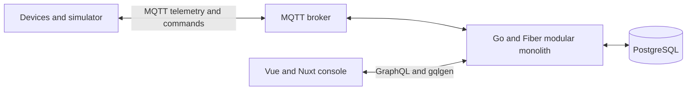

# PulseGrid

**Distributed IoT device operations platform**

Connect devices · Stream telemetry · Detect conditions · Deliver commands ·
Operate fleets


> [!IMPORTANT]
> PulseGrid is currently in documentation and planning. No application runtime
> or validated developer workflow has been implemented yet. This README
> describes the product direction and links to the detailed sources of truth.

## What is PulseGrid?

PulseGrid is a multi-tenant IoT operations platform for teams that manage
connected device fleets. It is designed around the operational lifecycle of a
device: provisioning, receiving telemetry, understanding current state,
detecting abnormal conditions, issuing remote commands, and investigating what
happened.

The project also explores how an IoT product can evolve from a simple,
well-bounded implementation into an event-driven distributed system only when
workload, reliability, or ownership requirements justify that complexity.

## Product capabilities

The target product includes:

- device provisioning, organization, search, and inspection;
- live connectivity, health, current values, and last-seen state;
- telemetry exploration and device history;
- threshold rules, operational alerts, and investigation context;
- asynchronous remote commands with acknowledgement, result, failure, and
  timeout states;
- tenant-aware access and audit history;
- device groups and progressive configuration or firmware rollouts.

Not every target capability belongs in the MVP. See the
[product scope](docs/product/product-scope.md) for the authoritative Foundation,
MVP, Post-MVP, and non-goal boundaries.

## MVP product loop

The MVP is intended to prove one complete loop:

```text
Provision device
    -> simulator publishes MQTT telemetry
    -> platform stores telemetry and current state
    -> threshold condition creates an alert
    -> operator investigates in the console
    -> operator sends a command
    -> simulator acknowledges or completes it
    -> console shows the final command state
```

The MVP does not require Kafka, microservices, Kubernetes, or specialized data
stores to demonstrate this behavior.

## Architecture overview

The initial runtime direction is a modular Go application with explicit logical
boundaries, a Nuxt web console, PostgreSQL, an MQTT broker, and a device
simulator.



Kafka, independently deployed services, gRPC, specialized databases,
distributed tracing, and Kubernetes remain part of the target direction, but
are introduced only when a concrete product or runtime requirement exists.

Detailed boundaries, data authority, failure behavior, and evolution are in
the [system architecture](docs/architecture/system-architecture.md).

## Core technology direction

| Area | Foundation / MVP | Conditional target |
| --- | --- | --- |
| Web console | Vue 3, Nuxt, TypeScript, Tailwind CSS v4, Nuxt UI | Realtime transport selected from product need |
| Backend and API | Go, Fiber, GraphQL, gqlgen | gRPC when an independent synchronous service boundary exists |
| Device transport | MQTT | Broker topology and production device identity remain open |
| Data | PostgreSQL | MongoDB, dedicated time-series storage, and Redis when access patterns justify them |
| Event processing | Direct modular boundaries for MVP | Kafka and consumer groups for concrete durable fan-out or scaling |
| Local runtime | Docker Compose for dependencies that are actually used | — |
| Operations | Structured logs and visible product state | OpenTelemetry, Prometheus, Grafana, Kubernetes, Helm, and KEDA when operational requirements exist |
| Delivery | Native Go/frontend checks and GitHub Actions | Deployment automation after a deployment target is selected |

The decision state and adoption trigger for each technology are maintained in
[technology decisions](docs/architecture/technology-decisions.md).

## Project status

**Current phase: Documentation foundation complete; implementation not started**

- Product intent and MVP boundary: documented.
- Architecture and technology adoption rules: documented.
- Dependency-ordered Foundation and MVP plans: documented.
- Application code: not started.
- Local application commands: not available yet.
- Production readiness: out of current scope.

Claims in this README should change from planned to implemented only after the
corresponding behavior has been validated.

## High-level roadmap

| Stage | Outcome | Status |
| --- | --- | --- |
| Documentation foundation | Sources of truth, MVP boundary, roadmap, and PR-sized plans | Complete |
| Executable repository foundation | Runnable Go and Nuxt shells with configuration, tests, local workflow, and CI | Planned |
| Device registry | Tenant-scoped device provisioning, list, and detail | Planned |
| Telemetry and current state | Simulator-to-console MQTT telemetry flow | Planned |
| Rules and alerts | A threshold condition creates an investigable alert | Planned |
| Remote command loop | Command delivery with acknowledgement, result, failure, and timeout | Planned |
| MVP acceptance | Repeatable end-to-end product loop | Planned |
| Post-MVP evolution | Security hardening, event scale, specialized data, observability, orchestration, and fleet operations | Deferred |

See the [roadmap](docs/roadmap/roadmap.md) for dependencies, outcomes, status,
and linked feature plans.

## Development entry points

There is no runnable application yet. Development commands will be added by the
Foundation plans together with the code and checks they operate.

- [Environment and configuration strategy](docs/project-setup/environment-configuration.md)
- [Foundation and MVP feature plans](docs/roadmap/feature-plans/README.md)
- [UI design system](docs/design/ui-design/ui-design-system.md)

Real `.env` files and secrets must not be committed. Development and test may
use explicit ignored local files; production configuration must be injected by
the deployment runtime or secret manager.

## Documentation map

| Document | Owns |
| --- | --- |
| [Product scope](docs/product/product-scope.md) | Product purpose, capabilities, MVP boundary, and non-goals |
| [System architecture](docs/architecture/system-architecture.md) | Logical boundaries, event/data design, reliability, observability, and runtime evolution |
| [Technology decisions](docs/architecture/technology-decisions.md) | Selected, conditional, deferred, and open technology choices |
| [Environment strategy](docs/project-setup/environment-configuration.md) | Development, test, and production configuration policy |
| [UI design system](docs/design/ui-design/ui-design-system.md) | Visual language, design tokens, components, responsive behavior, and accessibility |
| [Roadmap](docs/roadmap/roadmap.md) | Milestone order, dependencies, outcomes, and status |
| [Feature plans](docs/roadmap/feature-plans/README.md) | Intended PR scope, validation, risks, and done criteria |

## Engineering stance

- Product behavior before infrastructure.
- Logical boundaries before microservices.
- Events become contracts when concrete producers and consumers exist.
- Failure states are part of product behavior.
- Correctness and delivery semantics are proven before scaling complexity.
