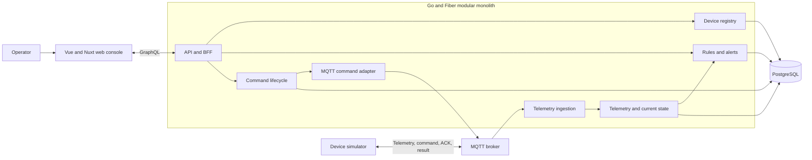
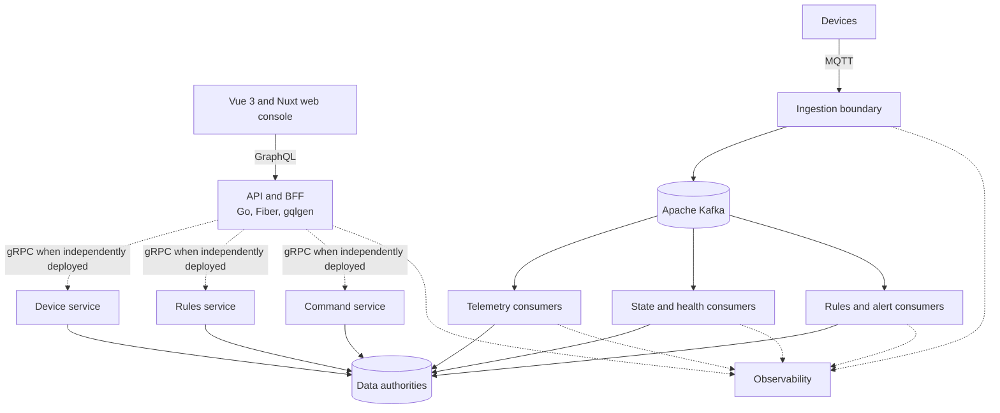
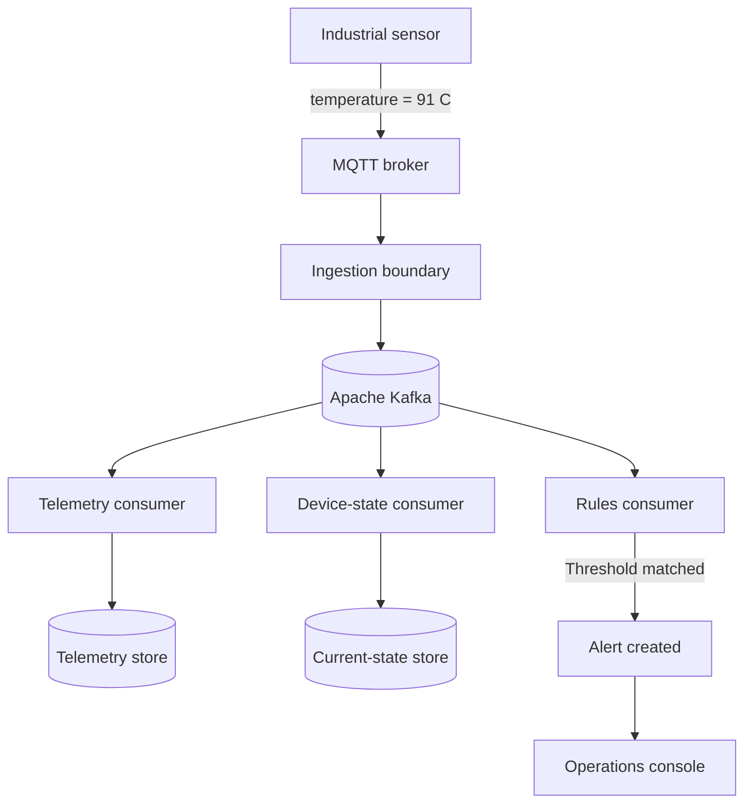
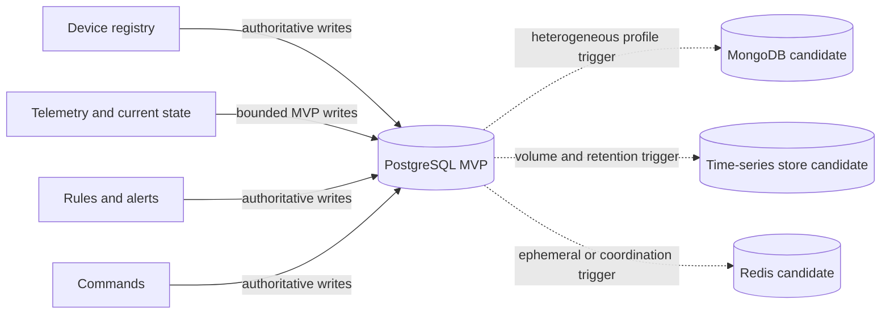
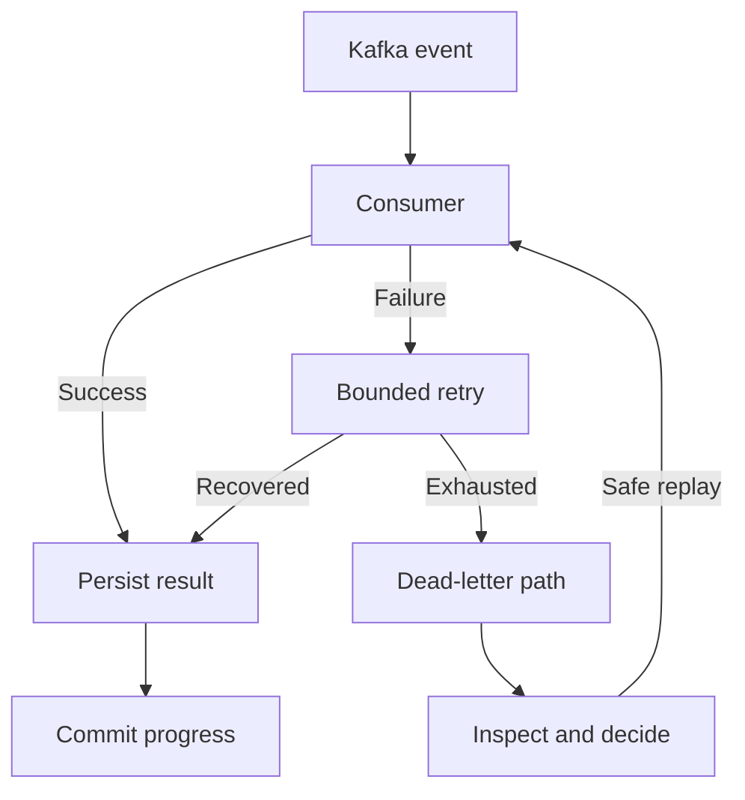
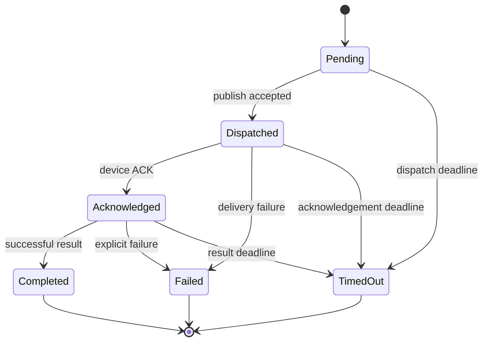
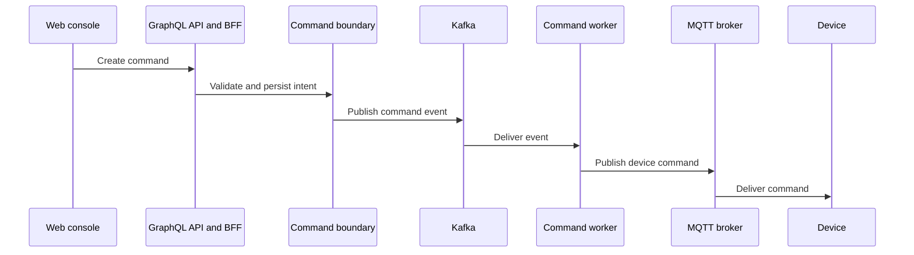
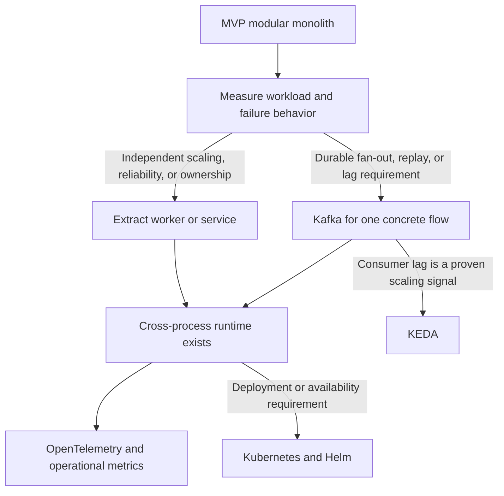

# PulseGrid System Architecture

Status: Planning source of truth

## Purpose and ownership

This document owns PulseGrid's logical boundaries, dependency direction, data
authority, event evolution, failure model, observability expectations, and
runtime evolution. Exact technology adoption status is owned by
[technology decisions](technology-decisions.md), while delivery status is owned
by the [roadmap](../roadmap/roadmap.md).

## Current state

PulseGrid currently consists of planning and design documentation. No
application runtime, database schema, event contract, or deployment topology
has been implemented or validated.

Architecture diagrams below describe an intended sequence of evolution. They
must not be read as deployed topology.

## Architecture principles

1. Product behavior precedes infrastructure.
2. Logical boundaries precede independently deployed services.
3. Events are versioned contracts once a concrete producer and consumer exist.
4. Duplicate delivery, retry, disconnect, timeout, and partial failure are
   normal operating conditions.
5. Important asynchronous work must expose understandable product state and
   diagnostic evidence.
6. Correctness and failure behavior must be proven before scaling complexity is
   introduced.

## MVP runtime shape

The MVP should begin as a modular monolith plus a web console and the smallest
local dependencies required by the product loop.

The modules are logical ownership boundaries inside one Go deployment. They are
not a commitment to separate services, databases, or repositories.

## Conditional target architecture

The following diagram preserves the long-term distributed direction. Every
service, gRPC boundary, Kafka consumer, and specialized data store is
conditional Post-MVP scope—not a topology to scaffold during Foundation or
MVP work.

Logical ownership from the MVP should make later extraction possible, but an
independent deployment is approved only when workload, reliability, or
ownership evidence identifies a separate scaling or failure unit.

## Logical ownership

| Boundary | Owns | Does not own |
| --- | --- | --- |
| Device registry | Device identity, tenant association, profile basics, lifecycle state | Telemetry history, alerts, command execution |
| Telemetry ingestion | MQTT input validation, device resolution, ingestion metadata | Long-term analytics or rule policy |
| Device state | Latest accepted measurements, connectivity, last-seen projection | Device ownership or command state |
| Rules and alerts | Limited threshold definitions, evaluation result, alert lifecycle | General workflow automation |
| Commands | Command intent, valid state transitions, delivery/ACK/result/timeout state | Device profile or transport-wide policy |
| API/BFF | GraphQL contract and composition for the console | Direct ownership of domain persistence |
| Web console | Operator journeys and presentation state | Domain authority or secret-bearing configuration |

Modules may share one PostgreSQL deployment in the MVP, but each module should
own its tables and write paths. Cross-module behavior should go through narrow
application interfaces rather than arbitrary table mutation.

## Event-driven evolution

The first telemetry and command flows should be implemented without a generic
Kafka abstraction. They should still use explicit input identifiers,
timestamps, versions, and correlation context so behavior can later cross a
durable event boundary without inventing semantics during extraction.

Kafka becomes a candidate only when a concrete flow needs one or more of:

- independent consumers with different scaling or failure behavior;
- durable replay;
- fan-out that should not share the ingestion transaction;
- measurable backpressure or consumer-lag control;
- independent deployment justified by ownership or reliability.

When that trigger occurs, topic design, partition keys, schemas, retry, dead
letters, and replay must be designed for the selected flow. They are not fixed
by this planning document.

### Conditional example: abnormal device temperature

This is the target event-driven form of the abnormal-temperature journey. It
becomes relevant only after Kafka is adopted for this concrete telemetry flow.

## Data architecture

### MVP authority

PostgreSQL is the MVP system of record for organizations, devices, bounded
recent telemetry, current-state projections, threshold rules, alerts, and
commands. Using one database deployment does not remove module-level write
ownership.

Telemetry retention must be deliberately bounded for the MVP. The initial
schema is a product-learning mechanism, not a permanent high-volume storage
decision.

### Conditional specialization

- MongoDB remains a target option for heterogeneous device profiles and
  capabilities when real document variability and query patterns justify a
  separate data authority.
- Dedicated time-series storage remains undecided until ingestion volume,
  retention, aggregation, and query requirements are measured.
- Redis is introduced only for a demonstrated cache, short-lived presence,
  coordination, rate-limit, or idempotency need with explicit authority and
  expiry semantics.

Any duplicated or derived data must identify its authoritative writer and its
reconciliation behavior.

## Reliability and failure model

The MVP must define and test at least these cases:

- malformed or unsupported MQTT payload;
- telemetry for an unknown or wrong-tenant device;
- duplicate telemetry identifiers;
- late or out-of-order device timestamps;
- broker disconnect and process restart;
- rule evaluation failure without silent data loss;
- repeated command delivery;
- acknowledgement, success, explicit failure, and timeout;
- graceful shutdown while work is in flight.

Retries must be bounded. A retry must not create a second logical command or a
second alert for the same accepted input. Exact delivery guarantees are defined
by each feature plan and validated at the boundary where the behavior exists.

Kafka retry and dead-letter mechanisms are Post-MVP concerns because the MVP
does not yet have a Kafka boundary.

### Conditional Kafka processing and recovery

This diagram is a target recovery shape, not an MVP dependency. Retry limits,
dead-letter ownership, and replay authorization must be defined by the Kafka
feature plan that introduces the flow.

### Remote command lifecycle

Transport retries may repeat delivery but must not create a second logical
command or bypass valid state transitions.

## Observability

MVP observability is intentionally local and diagnostic:

- structured logs;
- stable event, tenant, device, and command identifiers where applicable;
- correlation between GraphQL requests, MQTT input, and command processing;
- health/readiness information that reflects real dependencies;
- visible failure and timeout state in the product.

Metric names and distributed trace topology are not contracts yet.
OpenTelemetry, Prometheus, Grafana, and distributed tracing become appropriate
after there are cross-process boundaries and operational questions they must
answer.

### Conditional distributed trace path

Trace, correlation, tenant, device, event, and command identifiers should cross
this path only after these process boundaries exist. The exact spans and metric
names are intentionally not fixed yet.

## Runtime evolution

Stateful infrastructure does not automatically need to run in the same
Kubernetes cluster as application workloads. Deployment topology remains a
separate decision.

## Architecture change rule

A new runtime, database, message broker, shared contract, or deployment boundary
must identify:

- the product or operational requirement it satisfies;
- the owner and data authority;
- failure and recovery behavior;
- compatibility and migration implications;
- validation evidence;
- a removal or reversal path when the expected value does not materialize.

## Related documents

- [Product scope](../product/product-scope.md)
- [Technology decisions](technology-decisions.md)
- [Environment configuration](../project-setup/environment-configuration.md)
- [Roadmap](../roadmap/roadmap.md)
