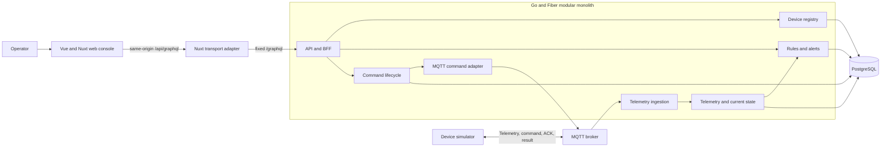
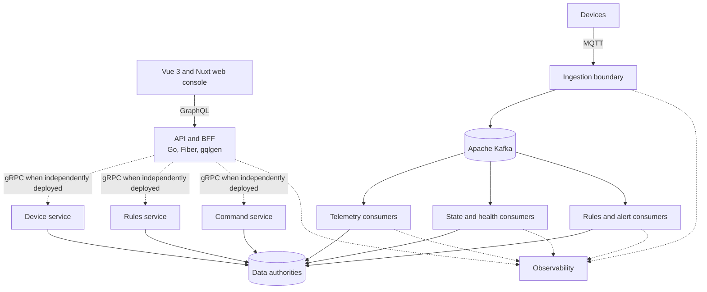
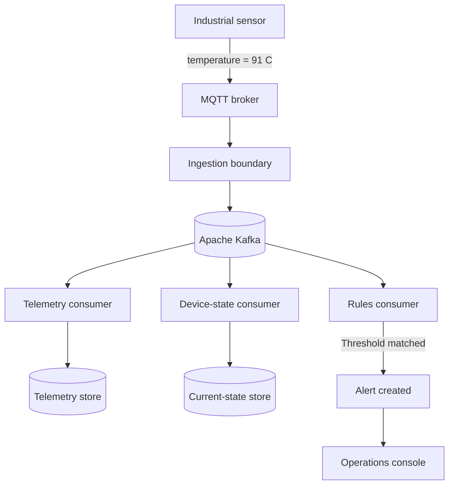
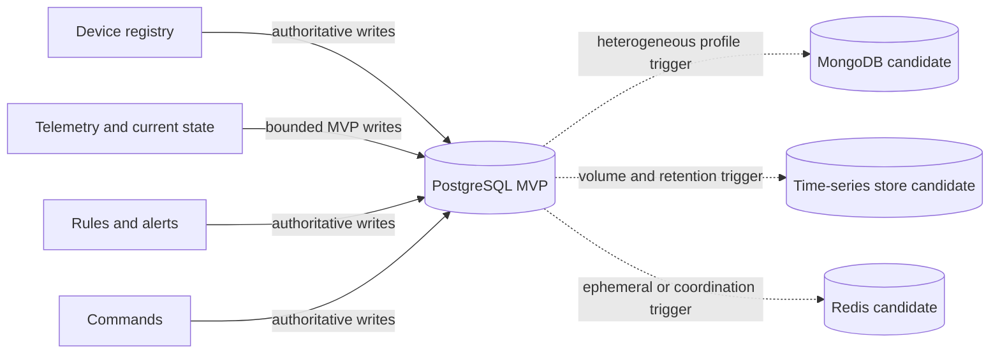
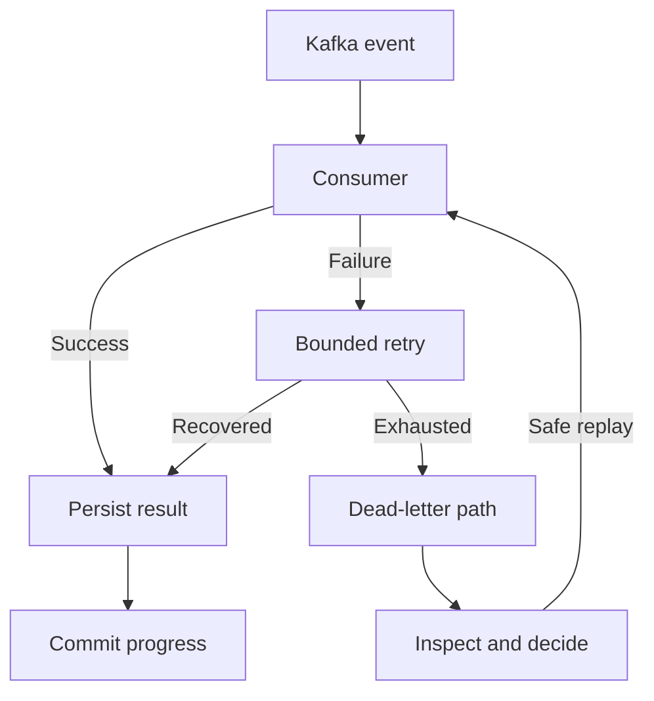
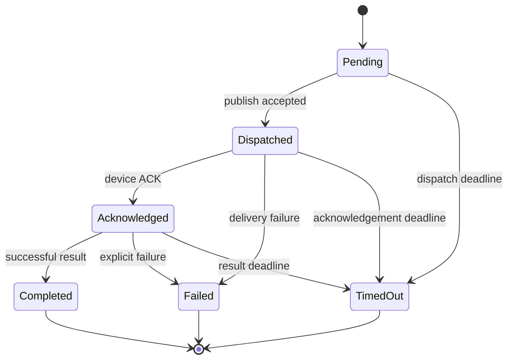
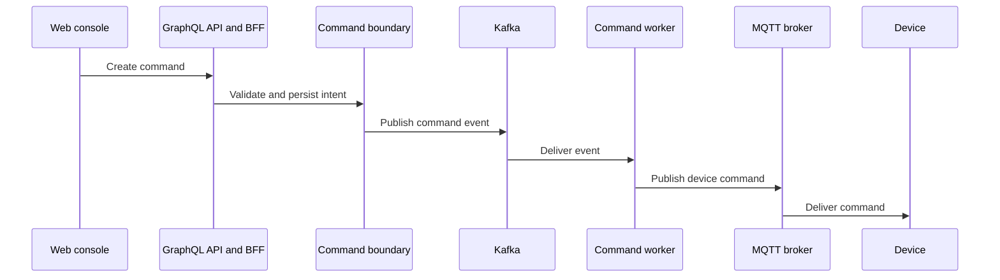
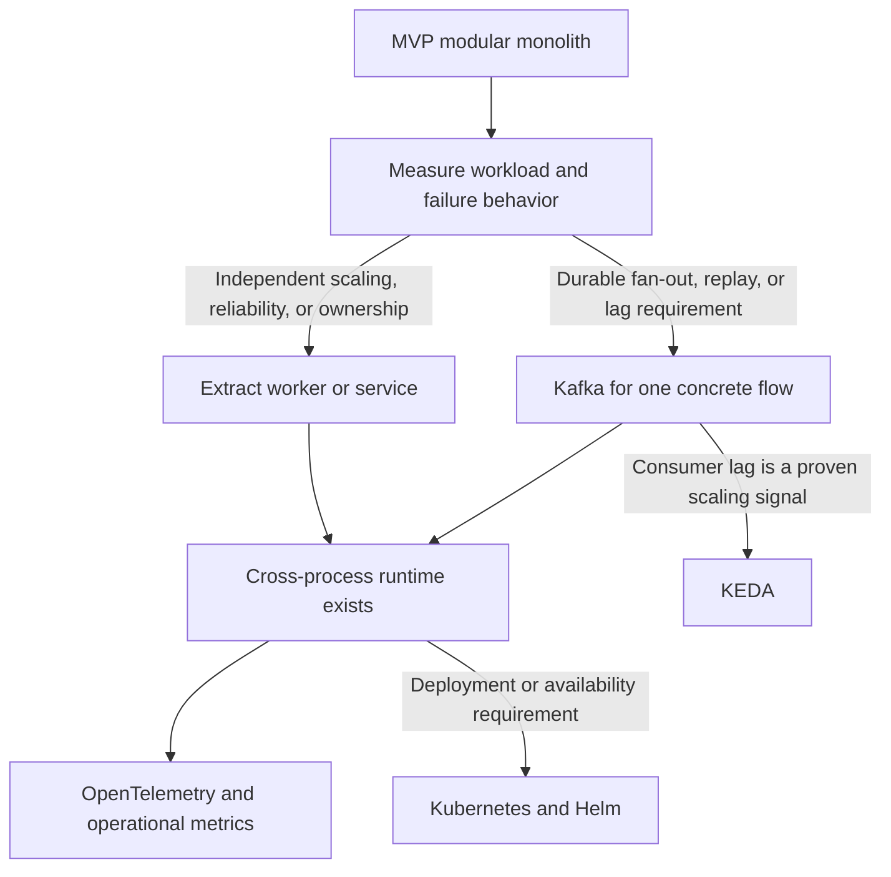

# PulseGrid System Architecture

Status: Planning source of truth

## Purpose and ownership

This document owns PulseGrid's logical boundaries, dependency direction, data
authority, event evolution, failure model, observability expectations, and
runtime evolution. Exact technology adoption status is owned by
[technology decisions](technology-decisions.md), while delivery status is owned
by the [roadmap](../roadmap/roadmap.md).

## Current state

The Go/Fiber API is implemented and validated as one modular process with
lifecycle, health, development-only GraphQL device endpoints, the local/test
MVP-005 MQTT telemetry consumer, and the merged MVP-006 local/test telemetry
history/current-state projection. MVP-003 provides the first device-registry
operator journey and a fixed same-origin Nuxt GraphQL transport adapter backed
by the MVP-001 organization/device registry. MVP-007 is planned to expose the
delivered telemetry reads on the existing device-detail route. Production
identity, deployment exposure, durable broker replay, and later event
contracts remain unimplemented.

Architecture diagrams below describe an intended sequence of evolution. They
must not be read as deployed topology.

## Architecture principles

1. Product behavior precedes infrastructure.
2. Logical boundaries precede independently deployed services.
3. Events are versioned contracts once a concrete producer and consumer exist.
4. Duplicate delivery, retry, disconnect, timeout, and partial failure are
   normal operating conditions.
5. Important asynchronous work must expose understandable product state and
   diagnostic evidence.
6. Correctness and failure behavior must be proven before scaling complexity is
   introduced.

## MVP runtime shape

The MVP should begin as a modular monolith plus a web console and the smallest
local dependencies required by the product loop.



The modules are logical ownership boundaries inside one Go deployment. They are
not a commitment to separate services, databases, or repositories.

### MVP-004 local transport fixture

MVP-004 now provides a separate host-run `device-simulator` command and two
local/test Mosquitto Compose services. The simulator owns only fixture
configuration, topic construction, telemetry serialization, and a bounded
QoS-1 publish. Mosquitto owns local MQTT transport and broker acknowledgement.
Both listeners are published only on loopback (`1883` for development and
`11883` for isolated tests), keep no broker persistence, and use no retained
telemetry. The simulator cannot target production or external brokers and does
not import or call the API, GraphQL, registry, database, or migration boundary.

This is a producer/transport fixture, not an application consumer. MVP-005 now
owns untrusted MQTT input validation, tenant/device resolution, duplicate
metadata, and application acceptance. The API keeps one PostgreSQL pool and
one Paho client when ingestion is explicitly enabled; readiness then requires
both PostgreSQL and connected-plus-subscribed MQTT, while liveness remains
process-only.

### MVP-005 local telemetry ingestion

The enabled local/test runtime is a bounded module inside the existing API
process:

```text
Mosquitto -> Paho adapter -> 64-item queue -> one worker
          -> strict topic/payload boundary -> registry resolution
          -> AcceptedTelemetry handoff -> diagnostic sink (MVP-005 boundary)
```

The Paho adapter copies delivery metadata and payload bytes before non-blocking
queue admission. The ingestion boundary owns exact topic levels, UTF-8/JSON
strictness, duplicate-key rejection, the 1 KiB payload cap, canonical UUIDs,
UTC/future-clock checks, QoS/retained rules, and registry authority. Every
delivery receives a fresh `IngestionID`; the producer `messageId` is preserved
for MVP-006, but no in-memory or durable deduplication is claimed here.

This handoff is intentionally non-durable: broker acknowledgement, enqueue
success, and registry lookup are not application persistence. Queue saturation,
registry failures, and consumer failures are explicit diagnostics, and a broker
outage degrades readiness while bounded Paho reconnect/resubscribe proceeds.

### MVP-006 telemetry persistence and current state

MVP-006 replaces the diagnostic sink at the accepted-telemetry port with a
PostgreSQL projection consumer in the same API process:

```text
AcceptedTelemetry
-> one transaction
   -> append-only device-scoped identity classification
   -> bounded history insert for a new logical observation
   -> current measurement compare by (ObservedAt, MessageID)
   -> independent LastSeenAt maximum for new logical observations
   -> selected current row + newest stored rows retained (max 1,000/device)
-> telemetry_accepted log after commit or exact replay
```

The append-only identity authority is the durable logical-observation and
conflict record; telemetry history is a bounded inspection view over newly
accepted observations. Pruning history cannot make a replay or conflicting
message-ID reuse look new. Current state is a derived read model with one
projection writer. Exact replay is a successful no-op that does not advance
state or last-seen. Reusing a logical ID with a different observed time or
temperature is a conflict and rolls back without a partial write. PostgreSQL
`timestamptz` values are normalized to its microsecond storage precision before
logical replay comparison. The identity table is intentionally append-only in
this MVP; its one compact row per accepted logical message is the explicit
capacity trade-off for the durable replay guarantee.

The API validates the required telemetry tables and columns before opening the
development listener or MQTT subscription. A database below migration 005 is
classified as `database_schema_unavailable` and fails startup rather than
reporting readiness for an unusable telemetry path.

The development GraphQL API exposes only bounded, tenant-scoped reads:
`deviceCurrentState` and `deviceTelemetry` (default 50, maximum 100) with a
telemetry-specific keyset cursor ordered by `observedAt DESC, messageId DESC`.
It does not expose ingestion IDs, MQTT duplicate metadata, storage sequence,
or organization authority. A database failure before commit is a processing
failure; MQTT transport acknowledgement does not provide automatic replay.

## Conditional target architecture

The following diagram preserves the long-term distributed direction. Every
service, gRPC boundary, Kafka consumer, and specialized data store is
conditional Post-MVP scope—not a topology to scaffold during Foundation or
MVP work.



Logical ownership from the MVP should make later extraction possible, but an
independent deployment is approved only when workload, reliability, or
ownership evidence identifies a separate scaling or failure unit.

## Logical ownership

| Boundary | Owns | Does not own |
| --- | --- | --- |
| Device registry | Device identity, tenant association, profile basics, lifecycle state | Telemetry history, alerts, command execution |
| MQTT transport adapter | Paho connect/subscribe/reconnect, bounded admission, connection readiness, and shutdown drain | Tenant authority, payload business rules, persistence, retries, or projection |
| Telemetry ingestion | MQTT input validation, device resolution, ingestion metadata, and the `AcceptedTelemetry` consumer port | Long-term analytics, persistence, current-state projection, or rule policy |
| Device state / telemetry projection | Bounded telemetry history, latest measurement, and last-seen projection | Device ownership or command state |
| Rules and alerts | Limited threshold definitions, evaluation result, alert lifecycle | General workflow automation |
| Commands | Command intent, valid state transitions, delivery/ACK/result/timeout state | Device profile or transport-wide policy |
| API/BFF | GraphQL contract and composition for the console | Direct ownership of domain persistence |
| Web console | Operator journeys, presentation state, and narrow same-origin readiness/GraphQL transport adapters | Domain authority, product API authority, tenant selection, or secret-bearing configuration |

Modules may share one PostgreSQL deployment in the MVP, but each module should
own its tables and write paths. Cross-module behavior should go through narrow
application interfaces rather than arbitrary table mutation.

## API boundaries and contract ownership

The API strategy is deliberately split by consumer and protocol:

- operational HTTP uses REST and OpenAPI, currently limited to the FND-001
  liveness and readiness endpoints;
- the operator-facing development product API uses GraphQL and gqlgen for the
  MVP-002 first device contract;
- the console reaches that contract through a fixed same-origin Nuxt adapter in
  MVP-003; the adapter bounds transport and failure behavior but owns no
  identity, tenant authority, domain validation, cache, or retry policy;
- MQTT and any later Kafka flow use flow-specific message contracts, documented
  with AsyncAPI only after a concrete producer and consumer exist;
- gRPC and Protocol Buffers remain conditional on an independently deployed
  synchronous service boundary.

The [API documentation index](../api/README.md) owns the human testing and
contract map. Machine-readable contracts remain next to the application or
producer that owns them. No REST CRUD surface is created merely to mirror the
GraphQL product API.

## Event-driven evolution

The first telemetry and command flows should be implemented without a generic
Kafka abstraction. They should still use explicit input identifiers,
timestamps, versions, and correlation context so behavior can later cross a
durable event boundary without inventing semantics during extraction.

Kafka becomes a candidate only when a concrete flow needs one or more of:

- independent consumers with different scaling or failure behavior;
- durable replay;
- fan-out that should not share the ingestion transaction;
- measurable backpressure or consumer-lag control;
- independent deployment justified by ownership or reliability.

When that trigger occurs, topic design, partition keys, schemas, retry, dead
letters, and replay must be designed for the selected flow. They are not fixed
by this planning document.

### Conditional example: abnormal device temperature

This is the target event-driven form of the abnormal-temperature journey. It
becomes relevant only after Kafka is adopted for this concrete telemetry flow.



## Data architecture

### MVP authority

PostgreSQL is the MVP system of record for organizations, devices, bounded
recent telemetry, current-state projections, threshold rules, alerts, and
commands. Using one database deployment does not remove module-level write
ownership.

Telemetry retention must be deliberately bounded for the MVP. The initial
schema is a product-learning mechanism, not a permanent high-volume storage
decision.

MVP-006 implements that boundary with a maximum of 1,000 logical history
observations per device. The append-only durable identity key is
`(device_id, message_id)` and stores the canonical observed time/value needed
for replay/conflict classification after history pruning. Current measurement
ordering is `(observed_at, message_id)` and `last_seen_at` is tracked separately
from the selected measurement. GraphQL history is bounded and keyset-paginated;
identity-authority growth is explicit and unbounded in this MVP, while
time-based history retention, aggregation, and specialized storage remain open
until volume and query evidence justify them.

### Conditional specialization

- MongoDB remains a target option for heterogeneous device profiles and
  capabilities when real document variability and query patterns justify a
  separate data authority.
- Dedicated time-series storage remains undecided until ingestion volume,
  retention, aggregation, and query requirements are measured.
- Redis is introduced only for a demonstrated cache, short-lived presence,
  coordination, rate-limit, or idempotency need with explicit authority and
  expiry semantics.

Any duplicated or derived data must identify its authoritative writer and its
reconciliation behavior.



## Reliability and failure model

The MVP must define and test at least these cases:

- malformed or unsupported MQTT payload;
- telemetry for an unknown or wrong-tenant device;
- duplicate telemetry identifiers;
- retained, oversized, future-skewed, and queue-saturated telemetry;
- late or out-of-order device timestamps;
- broker disconnect and process restart;
- rule evaluation failure without silent data loss;
- repeated command delivery;
- acknowledgement, success, explicit failure, and timeout;
- graceful shutdown while work is in flight.

Retries must be bounded. A retry must not create a second logical command or a
second alert for the same accepted input. Exact delivery guarantees are defined
by each feature plan and validated at the boundary where the behavior exists.

MVP-005 deliberately stops at the validated `AcceptedTelemetry` handoff. The
MVP-006 projection consumer owns device-scoped durable idempotency,
transactional history, current-state ordering, independent last-seen, and the
bounded retention policy. A transport-acknowledged message can still be lost
before this transaction commits; local recovery is explicit republish rather
than an automatic broker replay guarantee.

Kafka retry and dead-letter mechanisms are Post-MVP concerns because the MVP
does not yet have a Kafka boundary.

### Conditional Kafka processing and recovery



This diagram is a target recovery shape, not an MVP dependency. Retry limits,
dead-letter ownership, and replay authorization must be defined by the Kafka
feature plan that introduces the flow.

### Remote command lifecycle



Transport retries may repeat delivery but must not create a second logical
command or bypass valid state transitions.

## Observability

MVP observability is intentionally local and diagnostic:

- structured logs;
- stable event, tenant, device, and command identifiers where applicable;
- correlation between GraphQL requests, MQTT input, and command processing;
- health/readiness information that reflects real dependencies;
- visible failure and timeout state in the product.

Metric names and distributed trace topology are not contracts yet.
OpenTelemetry, Prometheus, Grafana, and distributed tracing become appropriate
after there are cross-process boundaries and operational questions they must
answer.

### Conditional distributed trace path



Trace, correlation, tenant, device, event, and command identifiers should cross
this path only after these process boundaries exist. The exact spans and metric
names are intentionally not fixed yet.

## Runtime evolution



Stateful infrastructure does not automatically need to run in the same
Kubernetes cluster as application workloads. Deployment topology remains a
separate decision.

## Architecture change rule

A new runtime, database, message broker, shared contract, or deployment boundary
must identify:

- the product or operational requirement it satisfies;
- the owner and data authority;
- failure and recovery behavior;
- compatibility and migration implications;
- validation evidence;
- a removal or reversal path when the expected value does not materialize.

## Related documents

- [Product scope](../product/product-scope.md)
- [Technology decisions](technology-decisions.md)
- [Environment configuration](../project-setup/environment-configuration.md)
- [Roadmap](../roadmap/roadmap.md)
