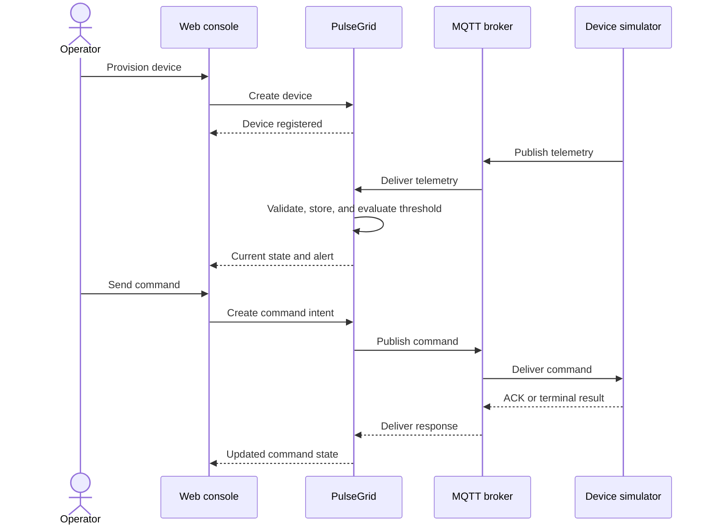
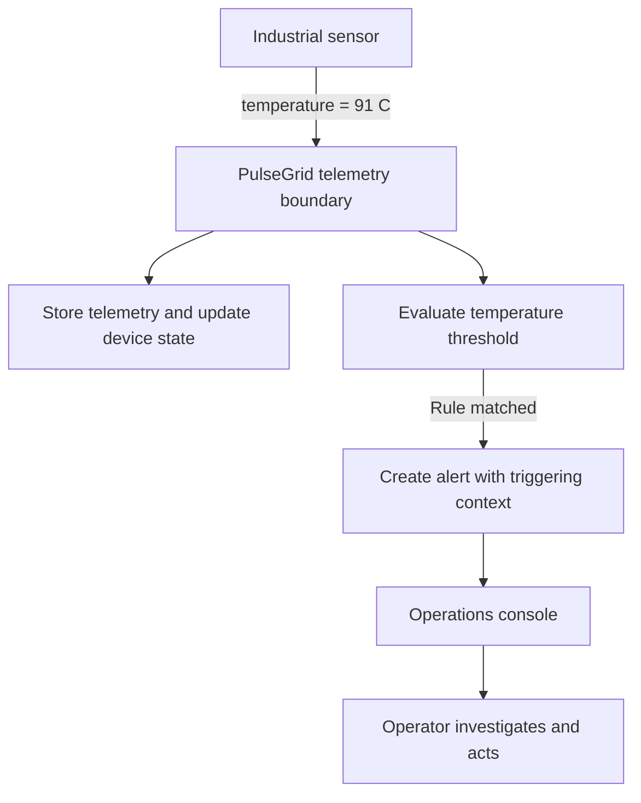

# PulseGrid Product Scope

Status: Planning source of truth

## Purpose

PulseGrid is a multi-tenant IoT operations platform for teams that need to
understand and control connected device fleets. It is organized around the
operational lifecycle of a device rather than generic device CRUD.

This document owns product purpose, capabilities, the primary product loop,
and the boundary between Foundation, MVP, and Post-MVP work. Implementation
status and delivery order are owned by the [roadmap](../roadmap/roadmap.md).

## Primary users

- Fleet operators who monitor devices and respond to abnormal conditions.
- Product or operations engineers who provision devices and investigate their
  behavior.
- Platform administrators who will eventually manage organizations, access,
  and operational policy.

## Product capabilities

PulseGrid is intended to support:

- device provisioning, organization, search, and inspection;
- live connectivity, health, current values, and last-seen state;
- telemetry exploration and device history;
- rules that identify operational conditions and create alerts;
- remote commands with delivery, acknowledgement, completion, failure, and
  timeout states;
- fleet-level configuration and firmware rollouts;
- tenant isolation, operational permissions, and audit history.

These are target capabilities, not a claim that every capability belongs in
the MVP or is currently implemented.

## Primary product loop

The first complete product proof is:

This loop is the acceptance boundary for the MVP. It is more important than
demonstrating every technology in the target stack.

## Example journey: abnormal device temperature

This product journey remains valid whether the implementation is the MVP
modular monolith or a later event-driven topology:

The product contract is the operator-visible alert and its traceable context.
Whether Kafka or a separate rules worker participates is an architecture
decision owned by the system architecture and roadmap.

## Delivery boundary

### Foundation

Foundation makes the repository executable, testable, and maintainable. It
includes:

- documentation ownership and reviewable feature plans;
- a runnable Go/Fiber application shell;
- a runnable Vue/Nuxt console shell;
- environment and configuration conventions;
- formatting, linting, testing, Git hooks, CI, and local workflow documentation.

Foundation does not claim product capability and does not introduce data,
messaging, or orchestration infrastructure without an immediate consumer.

### MVP

MVP includes only what is needed to prove the primary product loop:

- a tenant-aware device registry with a controlled development identity;
- device provisioning, list, and detail journeys;
- an MQTT broker and device simulator;
- validated telemetry ingestion;
- bounded recent telemetry and a current-device-state projection;
- one deliberately limited threshold-rule model and alert history;
- a persisted asynchronous command lifecycle with acknowledgement, result,
  failure, and timeout behavior;
- a console that exposes each stage of the loop;
- repeatable end-to-end validation.

The MVP is a non-production product proof. Tenant identifiers and isolation
tests are included to protect future data boundaries, but production identity,
RBAC, credential lifecycle, and operational hardening are not claimed.

### Post-MVP

Post-MVP work includes:

- production authentication, authorization, audit, and device credential
  lifecycle;
- Kafka-backed event distribution when a concrete flow needs independent
  consumers, replay, or workload scaling;
- MongoDB, dedicated time-series storage, and Redis when measured access
  patterns justify them;
- service extraction and gRPC when an independently deployed synchronous
  boundary exists;
- distributed tracing, operational metrics, dashboards, and SLOs;
- Kubernetes, Helm, and KEDA when deployment or scaling requirements justify
  their operating cost;
- device groups and progressive configuration or firmware rollouts.

## Explicit non-goals for MVP

- A production-ready multi-tenant SaaS release.
- Premature microservice deployment boundaries.
- Kafka introduced only to demonstrate event-driven terminology.
- Kubernetes or KEDA without a workload that needs orchestration or scaling.
- A general-purpose rules language.
- A permanent telemetry-store decision without volume, retention, and query
  evidence.
- Full fleet rollout and rollback workflows.

## Product acceptance principle

A capability is complete only when its operator-visible outcome and relevant
failure states are validated. A framework booting or an infrastructure
component running is supporting evidence, not proof of product behavior.

## Related documents

- [System architecture](../architecture/system-architecture.md)
- [Technology decisions](../architecture/technology-decisions.md)
- [UI design system](../design/ui-design/ui-design-system.md)
- [Roadmap](../roadmap/roadmap.md)
