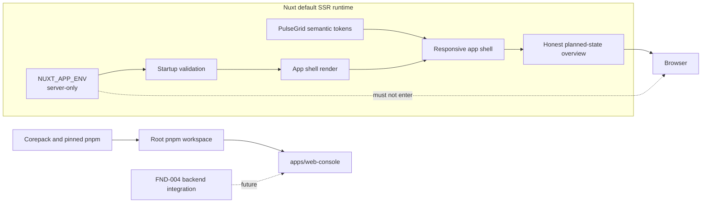

# FND-002 — Nuxt Console Foundation

Status: Complete

Review state: Implemented and validated on 2026-09-10

Branch: `feat/fnd-002-nuxt-console-foundation`

Intended PR: One frontend-foundation PR

Milestone: F0 — Executable repository foundation

Impact: Material Change (Tier 2) because this PR establishes the shared Node
toolchain, browser runtime-configuration boundary, and frontend application
structure used by later product slices.

## Goal

Create the first runnable Vue/Nuxt operations-console shell, using the existing
PulseGrid UI design system, without claiming product capability or connecting
to a backend.

## Acceptance Boundary

This PR is complete when a contributor can install the pinned Node workspace,
run the console, see a responsive and accessible PulseGrid shell with an honest
planned-state page, and execute the application-owned lint, typecheck, test,
build, and production-preview checks.

Backend connectivity remains the independently reviewable outcome of FND-004.

## Why

MVP operator journeys need a stable application shell, visual tokens,
navigation boundary, environment selection, and frontend validation surface.
Creating these before product pages avoids repeating setup in each journey
while keeping the first frontend PR free of invented domain behavior.

## Plan Review Outcome

- Keep FND-002 as one PR. Splitting workspace setup from the first runnable
  shell would create an intermediate PR with no independently useful runtime
  outcome.
- Do not add a browser-visible API base URL in this PR. There is no frontend to
  backend consumer until FND-004 selects the local proxy and origin policy.
- Do not render navigation links for unimplemented product areas. The shell has
  one real `Overview` destination and is structured so later plans can add
  routes without replacing the layout.
- Keep Nuxt's default SSR behavior. Authentication, hosting, or a proven
  browser-only dependency may trigger a later rendering review.
- Use application-owned checks now; repository-wide orchestration, hooks, and
  CI remain owned by FND-003.
- Keep Playwright dependency, browser installation, and committed browser-test
  infrastructure out of this PR. FND-003 owns the reusable browser-test
  foundation; FND-004 owns the first browser-to-backend journey.
- Use the UI design system as the visual authority, but review desktop and
  mobile shell concepts before implementation so layout details are explicit.

## Scope

### Root Node workspace

- Add a private root `package.json`, `pnpm-workspace.yaml`, and one
  `pnpm-lock.yaml` for JavaScript dependencies in the repository.
- Pin Node 24 LTS with a root `.node-version` and a compatible `engines.node`
  range. The reviewed implementation baseline is Node 24.20.0.
- Pin pnpm through the root `packageManager` field so Corepack selects one exact
  version. The reviewed implementation baseline is pnpm 12.3.4.
- Include only `apps/web-console` in the initial workspace; do not create an
  empty shared package or task-runner abstraction.

### Nuxt application

- Create `apps/web-console` as a private workspace package using Nuxt 4's
  `app/` directory structure, Vue 3, and TypeScript.
- Keep the default SSR rendering mode and add a safe, branded top-level error
  surface for route/runtime failures.
- Add application-owned `dev`, `build`, `preview`, `lint`, `lint:fix`,
  `typecheck`, and `test` commands. FND-003 will compose them at repository
  level without changing their meaning.

### Visual and interaction foundation

- Produce and review one complete desktop shell concept and one mobile shell
  state before writing browser-visible components. Concepts must follow the
  existing UI design system and contain no fake operational data.
- Implement semantic PulseGrid color, spacing, typography, radius, border,
  focus, and surface tokens rather than scattering raw values through
  components.
- Integrate Tailwind CSS v4 and Nuxt UI while retaining PulseGrid ownership of
  layout and visual hierarchy.
- Use Nuxt UI's Iconify integration with one outlined icon family; do not mix
  icon families or fetch icons from a runtime CDN.
- Self-host the Manrope and Noto Sans Thai variable fonts from package-managed
  assets so the browser does not depend on a third-party font request.
- Deliver a light theme only in this PR because the project has no approved
  dark-theme tokens. Do not expose a non-functional theme control.
- Implement a semantic responsive shell:
  - desktop: 240px persistent sidebar with the PulseGrid identity and one real
    `Overview` destination;
  - tablet: narrower/collapsible presentation without hidden content;
  - mobile: compact header and single-column content; do not add a drawer while
    there is only one destination.
- Add a planned-state page that says product data and backend connectivity are
  not available yet. Do not render sample metrics, fake health, disabled
  product controls, charts, maps, or invented status.
- Include semantic landmarks, one page-level heading, a skip link, visible
  keyboard focus, reduced-motion-safe behavior, and readable 320px-wide
  reflow.

### Configuration boundary

- Add one consumed server-only key, `NUXT_APP_ENV`, validated as exactly
  `development`, `test`, or `production` during server startup.
- Add reviewed `.env.example`, `.env.development.example`,
  `.env.test.example`, and `.env.production.example` files under
  `apps/web-console`; real `.env*` files remain ignored.
- Development may explicitly load `.env.development`; tests inject `test`
  deterministically; production preview receives `NUXT_APP_ENV=production`
  from the process and must not auto-load development or test files.
- Define an empty public runtime-config surface. Add no `NUXT_PUBLIC_*` key
  until a browser consumer exists; FND-004 owns the first API routing key if
  its proxy/origin decision requires one.

### Application-owned quality boundary

- Use the official Nuxt ESLint flat-config integration with stylistic rules as
  the formatter/linter for frontend source; do not add a second formatter.
- Use Vitest, Nuxt Test Utils, Vue Test Utils, and a DOM test environment for
  focused configuration and shell component tests.
- Keep the light-only theme deterministic by disabling Nuxt UI's color-mode
  module until an approved dark-theme contract exists.
- Keep committed browser-to-backend E2E infrastructure out of this PR.
  FND-003 owns the Playwright foundation and FND-004 owns the first automated
  full-stack browser journey.

## Out of Scope

- Device, telemetry, alert, command, rule, map, table, metric, or chart product
  screens.
- Apache ECharts; it enters with the first real telemetry chart requirement.
- Backend calls, readiness display, API base URL, proxying, CORS, or GraphQL
  client selection.
- Authentication, authorization, tenant data, browser credential storage, or
  protected-route behavior.
- Global state or server-state libraries, realtime transport, analytics, or
  frontend observability services.
- Dark theme, localization framework, production hosting, Dockerfile, or
  deployment configuration.
- Playwright dependency, browser binaries, and committed browser-test
  configuration; those belong to FND-003 and FND-004.
- Root aggregate commands, Husky, lint-staged, Redocly, and GitHub Actions;
  these belong to FND-003.

## Dependencies

- DOC-001 — complete.
- FND-001 is not a merge prerequisite because this PR has no backend
  integration, but it is the adjacent runtime that FND-004 will compose.

## Architecture / Boundaries

The console owns presentation and interaction state. It must not become an
authority for tenant, device, alert, command, or environment policy. Nuxt
server-only runtime configuration must not cross into the browser payload.

### Ownership map

| Surface | Owner in this PR | Boundary preserved |
| --- | --- | --- |
| Root `package.json`, workspace file, lockfile, `.node-version` | Node toolchain | No generic task runner or shared package |
| `apps/web-console/package.json` and Nuxt config | Web application | App-native commands remain independently runnable |
| `app/app.vue` and default layout | Application composition | No product or server-data authority |
| Shell components | Navigation and responsive chrome | One implemented route only |
| `app/pages/index.vue` | Planned-state content | No fake domain data or backend status |
| `app/app.config.ts` and global CSS | Semantic UI tokens | UI design document remains the design source of truth |
| Server runtime-config validator | Environment selection | Private config is never read from browser code |
| Application tests | FND-002 behavior evidence | Repository CI remains FND-003 |

## Implementation Direction

1. Create and approve desktop/mobile shell concepts from the existing design
   reference. Record exact visible copy, layout, responsive behavior, tokens,
   font treatment, and icons before coding.
2. Establish the root Node/pnpm contract, then generate the Nuxt application
   without Git initialization, alternate lockfiles, demo pages, telemetry, or
   hosting-provider configuration.
3. Add Nuxt UI, Tailwind, the local font assets, app configuration, and
   semantic tokens. Use Nuxt UI components only where they add real semantic or
   accessibility behavior.
4. Implement the composition root, layout, minimal shell, planned-state route,
   and safe top-level error surface as small focused components.
5. Implement and test `NUXT_APP_ENV` parsing/startup validation. Keep
   `runtimeConfig.public` empty and avoid direct `process.env` reads in Vue
   components.
6. Add application-owned lint, typecheck, component/unit test, build, and
   preview commands.
7. Run the full validation matrix, inspect the dependency and generated-file
   diff, fix in-scope findings, and update the project documentation and plan
   status only after the evidence passes.

Version policy for this PR:

- Keep the selected major lines: Node 24 LTS, pnpm 12, Nuxt 4, Nuxt UI 4,
  Tailwind CSS 4, and supported current test/lint majors.
- Resolve compatible patch versions during implementation and record the exact
  dependency graph in `pnpm-lock.yaml`.
- A required major-version change, prerelease dependency, or peer-dependency
  override is a stop condition for plan review rather than a routine install
  fix.

## Validation

| Guarantee | Required evidence |
| --- | --- |
| Reproducible toolchain | Node and pnpm pins are honored; a clean `pnpm install --frozen-lockfile` succeeds without another lockfile |
| Static correctness | Application `lint`, `typecheck`, and `test` commands pass independently |
| Rendering | Development server and production build/preview render the planned-state route without hydration or browser-console errors |
| Honest product state | Visible copy and DOM contain no fabricated device, telemetry, alert, command, or backend-health values |
| Runtime-config isolation | Missing/invalid `NUXT_APP_ENV` fails with an actionable server error; development, test, and production cases pass; a server-only sentinel is absent from rendered HTML, hydrated payload, and client assets |
| Visual fidelity | Latest browser screenshots are compared with the approved desktop and mobile concepts; palette, typography, spacing, shell anatomy, icons, and visible copy match |
| Responsive behavior | Browser verification at 1440x900, 768x1024, 390x844, and 320px width shows usable reflow with no clipped primary content or horizontal page overflow |
| Accessibility | Landmarks, heading order, skip link, keyboard navigation, focus visibility, reduced motion, readable contrast, and accessible names pass focused inspection |
| Error behavior | Unknown route and top-level error surfaces are understandable, recoverable, and do not expose stack traces or server configuration in production mode |
| Asset policy | Fonts and icons are served from application assets; normal page load makes no third-party font or icon request |
| Dependency hygiene | Installed packages are limited to the selected runtime, UI, lint, and test roles; scaffold-only and duplicate dependencies are removed |

FND-003 will make these commands authoritative in CI. Their absence from CI in
this PR is a known milestone limitation, not permission to omit local evidence.

## Documentation Updates

- Create `apps/web-console/README.md` with requirements, Corepack/pnpm setup,
  environment preparation, dev/build/preview, and validation commands.
- Add the implemented `NUXT_APP_ENV` contract and precedence behavior to the
  environment strategy; do not document an API URL before FND-004 consumes it.
- Update technology decisions with the selected Node runtime, pnpm pinning
  mechanism, Nuxt rendering decision, lint/test choices, font delivery, and
  light-theme boundary.
- Update the root README project status and development entry points without
  duplicating application commands.
- On completion, move this plan to `completed/`, set its status to `Complete`,
  add completion evidence, and update roadmap/index links in the same change.

## Expected Review Findings and Stop Conditions

The implementation review should check the following likely failure classes in
one pass so fixes can be grouped before final validation:

| Expected finding | Expected outcome |
| --- | --- |
| Generated Nuxt demo content, unused routes, alternate lockfile, or hosting defaults remain | Remove them before feature work begins |
| Package-manager, Node, Nuxt, Nuxt UI, or test peer versions do not agree | Resolve within the approved major lines; stop for review if that requires a major change or override |
| Raw UI colors or default Nuxt UI theme replace PulseGrid tokens | Map the approved semantic tokens and verify the actual browser output |
| System dark mode changes an undefined theme | Keep the reviewed light theme deterministic; defer dark mode |
| Planned navigation looks interactive but has no implemented route | Remove it; keep only the real Overview destination |
| SSR hydration warning, client exception, or layout shift appears | Treat it as blocking and fix before browser acceptance |
| Server-only runtime value appears in HTML, payload, or client assets | Treat it as blocking; correct the config boundary and rerun artifact/browser checks |
| Font or icon rendering requires a third-party browser request | Bundle/self-host the asset or stop if the selected dependency cannot support that boundary |
| Keyboard focus, semantic landmarks, contrast, or 320px reflow fails | Treat it as blocking for the shell and fix before completion |
| A fix requires API connectivity, CORS, authentication, product state, E2E infrastructure, or a new shared package | Stop and re-plan; do not absorb FND-003/FND-004/MVP work into this PR |

Routine generated-file cleanup, patch-compatible dependency resolution, token
adjustment, and test repair remain in scope. Report any finding that changes
the approved major versions, architecture, public behavior, security boundary,
or PR size before implementing that expansion.

## Rollback / Reversibility

No existing runtime consumes the new frontend. If the foundation direction is
rejected before later plans depend on it, revert this PR to remove
`apps/web-console` and the root Node workspace files. FND-001 remains runnable
because the Go module does not depend on pnpm or frontend source.

## Risks / Open Decisions

- Exact dependency patch versions are selected and locked in the workspace
  lockfile; their compatibility is covered by the application checks below.
- Desktop and mobile shell concepts were reviewed before browser-visible
  implementation.
- Nuxt UI has a broad transitive dependency graph. The PR must use its selected
  primitives intentionally and inspect the resolved production dependency
  surface rather than adding overlapping UI libraries.
- GraphQL client/cache policy, live-update transport, API proxy/origin policy,
  authentication, protected routing, dark theme, localization, and production
  deployment remain intentionally open until a consuming plan requires them.
- Mobile navigation is deliberately minimal while only one route exists; the
  first plan that adds multiple operator destinations must review a `Menu`
  button (icon plus visible label), drawer/scrim behavior, focus management,
  Escape handling, and focus restoration. The desktop sidebar toggle is a
  local presentation state and is intentionally implemented here.
- Playwright is recommended for future browser evidence because it can own the
  web-server lifecycle, responsive browser projects, and retry traces, but its
  dependency and browser download are deferred to FND-003.

## Engineering Improvement Review

- Current scope: deterministic toolchain pins, honest planned state, safe
  server-only environment selection, a branded error surface, semantic and
  accessible shell structure, local font/icon delivery, and explicit browser
  evidence. Each is tightly coupled to the first frontend runtime and prevents
  misleading or unsafe foundation behavior.
- Future enhancements: backend connection states (FND-004), product navigation
  and data states (MVP plans), CI/hooks (FND-003), and authentication/realtime/
  observability only at their roadmap triggers.
- Scope effect: remains one frontend-foundation PR; no new product,
  infrastructure, or cross-service boundary is introduced.

## Done Criteria

- The root Node workspace and `apps/web-console` install reproducibly with the
  documented Node/Corepack/pnpm workflow.
- The console runs in development and production-preview modes, renders the
  approved PulseGrid shell and truthful planned-state page, and provides a safe
  top-level error surface.
- Development, test, and production environment selection is explicit and
  validated; no private value is exposed to the browser and no unused public
  runtime key exists.
- Application lint, typecheck, unit/component tests, production build, runtime
  smoke, browser fidelity, responsive, and accessibility checks pass with
  evidence recorded in the PR/plan.
- No backend connection, product-domain behavior, fake operational data,
  Docker or deployment infrastructure, repository-wide CI, or speculative
  shared abstraction is included.

## Completion Evidence

- Root workspace pins are present: Node `24.20.0`, pnpm `12.3.4`, and one
  `pnpm-lock.yaml`. pnpm build-script approval is limited to the required
  `esbuild`, `unrs-resolver`, and `vue-demi` packages in
  `pnpm-workspace.yaml`.
- Nitro runtime imports are backed by the direct `nitropack` dev dependency;
  the peer-qualified lockfile entry recreates a valid `nitropack/runtime`
  resolver target under `pnpm install --frozen-lockfile`.
- The following application checks pass:
  `corepack pnpm --filter @pulsegrid/web-console lint`, `typecheck`, `test`,
  and `build`; the test run reports 3 files and 10 tests passed.
- Production preview starts with `NUXT_APP_ENV=production` and serves the
  planned-state route. Missing and invalid `NUXT_APP_ENV` both fail Nitro
  startup with the actionable enum error.
- Rendered HTML and client assets contain no `NUXT_APP_ENV` or
  `NUXT_PUBLIC_*` runtime value. The browser payload reports an empty public
  config object.
- Browser verification passed at 1440x900, 390x844, and 320px widths. The
  mobile `Overview` state has a transparent background, zero radius, and a
  3px `var(--pulse-primary-hover)` dark-teal underline; the desktop sidebar
  retains its active soft background and left border. No horizontal overflow
  or browser console warning/error was observed.
- Post-review corrections are covered by focused evidence: the light-only
  runtime no longer follows a persisted/system dark class, the error route has
  a meaningful document title and explicit primary text color, and the
  desktop/tablet sidebar toggle exposes `Collapse sidebar`/`Expand sidebar`
  names with synchronized `aria-expanded` state while preserving the mobile
  compact-header contract.
- Tailwind v4 canonical utility forms are used for the error surface:
  `tracking-label` and `text-pulse-text-muted` are backed by semantic `@theme`
  tokens instead of arbitrary-value classes.
- Framework diagnostics are clean in application source: the error page reads
  Nuxt's non-deprecated `error.status`, the Nitro plugin uses explicit
  `nitropack/runtime` imports, and Vitest assertions use `toThrow` rather than
  the deprecated `toThrowError` alias.
- Workspace diagnostics are documented in `apps/web-console/README.md`:
  Tailwind v4's intentional `@theme` directive is handled by Zed's
  `tailwindcss-intellisense-css` language server through the repository
  `.zed/settings.json`, and the installed workspace package graph resolves
  Nuxt Test Utils and Vitest type declarations.

## Completion Gate

The reviewed scope was implemented on
`feat/fnd-002-nuxt-console-foundation`. Required local evidence passed; the
remaining repository-wide CI, hooks, backend connection, and product behavior
are intentionally owned by FND-003, FND-004, and the MVP plans.
