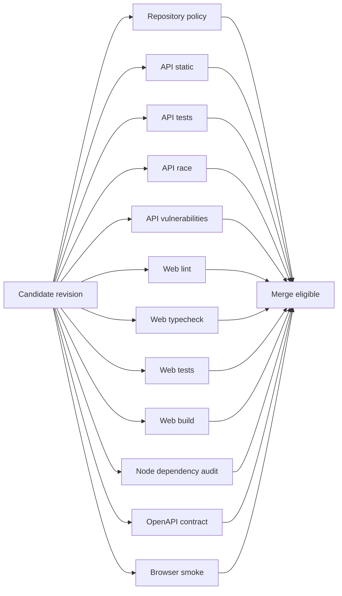

# FND-003 — Repository Quality and Local Workflow

Status: In progress

Review state: Implementation plan approved and implementation started against
repository state on 2026-09-10; first GitHub run passed, while merge-gate
enforcement evidence remains pending.

Branch: `chore/fnd-003-repository-quality-and-local-workflow`

Intended PR: One repository-tooling PR

Milestone: F0 — Executable repository foundation

Impact: Material Change (Tier 2) because this PR establishes repository-wide
CI, merge gates, dependency-audit behavior, and the browser-test boundary used
by later product work.

## Goal

Provide one documented local workflow and an authoritative, fast CI boundary
for the existing Go and Nuxt foundations without duplicating their
application-owned commands or absorbing FND-004 integration work.

## Acceptance Boundary

This PR is complete when a contributor can set up and validate both
applications from the repository root, every material native check is enforced
by an independently named required CI job, the first deterministic Playwright
smoke runs in isolated test mode, and `main` cannot merge a candidate that
fails any required job.

The target warm CI critical path is approximately two minutes from the first
required job starting to the last required job completing, excluding GitHub
runner queue time. The target is an optimization constraint, not permission to
remove or weaken a quality gate.

## Why

Independent application commands are insufficient if contributors cannot run
consistent repository-level checks or if CI does not enforce them. The current
test suites are fast; CI latency will be dominated by runner startup,
dependency installation, cache restoration, and browser provisioning, so the
pipeline must parallelize independent guarantees rather than serialize them
behind a shared setup job.

## Plan Review Outcome

- Keep FND-003 as one repository-tooling PR. The root commands, hooks, CI,
  browser-test foundation, and canonical local guide form one independently
  useful developer-workflow outcome.
- Use the existing root `package.json` as the composition layer. Do not add
  Nx, Turborepo, Make, Taskfile, `concurrently`, or another task runner.
- Preserve FND-001's Go commands and FND-002's frontend commands as the native
  contracts. Root commands compose them without changing their meaning or
  hiding their output.
- Do not change the existing real-`.env` ignore rules; they already ignore
  `.env` and `.env.*` while allowing reviewed example files. Add a deterministic
  tracked-filename policy check so forced additions cannot bypass the intended
  repository rule.
- Keep Redocly lint, bundle, and static rendering because FND-001 explicitly
  deferred their repository authority to FND-003. Produce an ephemeral CI
  artifact only; do not publish documentation or add a runtime docs server.
- Keep the Playwright foundation, but limit it to the existing planned-state
  shell. It converts FND-002's manual browser evidence into repeatable
  regression evidence and gives FND-004 a stable browser runner without taking
  ownership of the first frontend-to-backend journey.
- Run only Chromium in this plan. Do not add a cross-browser matrix or visual
  snapshot baseline before a product journey requires that cost.
- Hooks run only fast staged-file checks. Unit, race, build, audit, and browser
  evidence belong to the explicit pre-CI handoff and authoritative CI jobs.
- Keep every material CI job required. No current suite is expensive enough to
  justify moving its merge authority to a non-blocking or scheduled job.
- Do not add another secret scanner. GitHub secret scanning and push protection
  are already enabled for the repository; retain them and add only the
  repository-specific `.env` filename check.
- Configure branch protection only after the checks have run successfully and
  their stable names exist. This external repository mutation requires
  separate explicit approval during implementation.

## Current Repository Evidence

The pre-edit inspection baseline was commit `a2e31cd` on branch
`chore/fnd-003-repository-quality-and-local-workflow`:

- Before this plan revision, the branch matched `main` and contained no
  implementation changes. There were no GitHub Actions workflows, Husky hooks,
  lint-staged configuration, Redocly dependency, or Playwright dependency in
  the repository.
- `main` has no branch-protection rule or ruleset, and the repository has no
  workflow-run history. A workflow file alone would therefore not create an
  authoritative merge boundary.
- Go `1.27.1`, Node `24.20.0`, and pnpm `12.3.4` match the repository pins.
- Current warm native checks pass. Observed local command times were
  approximately 0.5 seconds for Go format inspection, 0.3 seconds for
  `go vet`, 0.2 seconds for ordinary Go tests, 3 seconds for race tests,
  0.9 seconds for frontend lint, 2.3 seconds for typecheck, 3 seconds for
  Vitest, and 6.3 seconds for the Nuxt build.
- A warm `pnpm install --frozen-lockfile` still spent approximately 5 seconds
  verifying 1,131 lockfile entries. CI startup and dependency materialization,
  rather than the current application checks, are the expected latency floor.
- Redocly CLI `2.51.2` successfully bundled and rendered the current
  operational contract. The `recommended` ruleset produced only the
  `info-license` warning; PulseGrid has no selected repository or API license,
  so that rule needs one explicit, documented exception rather than invented
  license metadata.
- `pnpm audit --prod` reports one low-severity transitive `esbuild` advisory.
  `pnpm peers check` exits non-zero because `@bomb.sh/tab@0.0.19` declares
  `cac@^6.7.14` while the resolved graph contains `cac@7.0.0`.
- `govulncheck@v1.8.0 ./...` reports no reachable vulnerability. It reports
  four `golang.org/x/crypto` module findings in packages the current code does
  not call.
- GitHub secret scanning and push protection are enabled, and there are no open
  secret-scanning alerts.

These measurements describe the current local machine, not GitHub-hosted
runner performance. The first GitHub-hosted run is now evidence for this
revision; future runner queue and cache behavior may vary.

## Implementation Evidence So Far

- Root scripts, exact Node tooling pins, Redocly configuration, Playwright
  configuration/tests, Husky/lint-staged, repository-policy helpers, local
  development documentation, and the independently named workflow are present
  on this branch.
- `corepack pnpm install --frozen-lockfile`, `corepack pnpm run check:fast`,
  and `corepack pnpm run check` pass locally. The full handoff includes Go
  race tests, Go and Nuxt builds, OpenAPI lint/bundle/static rendering, Node
  production audit, and reachable Go vulnerability scanning.
- The staged `sh .husky/pre-commit` path passes with the full implementation
  staged. A browser smoke run passes all 8 Chromium tests across desktop,
  tablet, mobile, and 320px widths when the host permits Chromium launch.
- The first non-elevated macOS browser attempt was blocked before page launch
  by the host's Chromium Mach-port sandbox; this is recorded as environment
  evidence, not a passing test result. The elevated rerun passed.
- Workflow YAML parsing, action full-SHA/comment policy, required-job count,
  and absence of a cross-job dependency chain pass locally. GitHub run
  `34454150901` for PR #3 passed all 12 jobs; the slowest `browser-smoke` job
  completed in 1m27s, keeping the observed critical path under two minutes.
- The preceding run `34452572837` exposed three environment/ordering issues:
  setup-node's implicit pnpm cache ran before Corepack, Nuxt generated files
  were missing before lint/Vitest, and hidden OpenAPI artifacts were excluded.
  It also exposed a real Fiber listener-registration/shutdown race under
  `-race`. Commit `48a6ac2` fixes these without demoting any check. Branch
  protection and required-check enforcement remain unverified and
  approval-gated.

## Scope

### Repository commands and tooling

- Add root commands for setup, application-specific run, format, format check,
  lint, typecheck, unit tests, race tests, build, OpenAPI validation, browser
  smoke, dependency audit, fast validation, and the full pre-CI handoff.
- Add small repository-owned helpers only where a native command cannot express
  a reliable failing check, such as Go format and tracked `.env` filename
  validation. Helpers must print the native failure output and return a
  non-zero status.
- Pin the reviewed tooling versions exactly in the root workspace:
  `@playwright/test@1.63.0`, `@redocly/cli@2.51.2`, `husky@9.1.7`, and
  `lint-staged@17.5.0`. Record their resolved dependency graph in the existing
  root `pnpm-lock.yaml` without introducing another lockfile.
- Pin the Go vulnerability command as
  `golang.org/x/vuln/cmd/govulncheck@v1.8.0` rather than invoking an unbounded
  `latest` version in CI.

### OpenAPI workflow

- Add a root Redocly configuration that names
  `apps/api/api/openapi/operational.yaml`, extends `recommended`, and fails on
  every unapproved warning.
- Disable only `info-license`, with a comment that the exception expires when
  the repository adopts a license or the API receives a publication contract.
- Expose separate lint, bundle, and static HTML commands. Bundle and render
  into a generated artifact directory that remains untracked.
- Upload the bundled contract and static HTML from the OpenAPI CI job with a
  short retention period. The artifact is for review evidence, not deployment
  or publication.

### Browser-test foundation

- Add one root `playwright.config.ts` and a focused planned-state browser smoke
  under a repository-owned browser-test directory.
- Use one pinned Chromium project and install only the Chromium headless shell
  plus required Linux dependencies in CI.
- Start a freshly built Nuxt server on a fixed loopback test port with
  `NUXT_APP_ENV=test`. Never reuse an existing server; an occupied port must
  fail rather than silently target a development process.
- Cover planned-state rendering, desktop/tablet/mobile/320px reflow, absence of
  horizontal page overflow, the primary keyboard interaction, page errors,
  and browser-console errors. Do not duplicate FND-002's full manual visual
  review or add product assertions.
- Use one CI worker, one retry, `failOnFlakyTests`, and a trace on the first
  retry. Upload Playwright diagnostics only for failed or flaky runs and retain
  them briefly.

### Local feedback and hooks

- Add Husky and lint-staged through the pinned root workspace.
- Use the pre-commit hook for staged Go formatting, staged frontend ESLint,
  staged OpenAPI lint, and the tracked `.env` filename policy only.
- Do not run unit, race, build, dependency-network, or browser checks from a
  Git hook. Document the explicit full pre-CI command as the readiness boundary
  before opening or updating a pull request.

### Authoritative CI and merge enforcement

- Add one GitHub Actions workflow triggered by pull requests targeting `main`,
  pushes to `main`, and manual dispatch.
- Use a fixed Linux runner image, top-level `contents: read` permissions, no
  production secrets, and no `pull_request_target` trigger.
- Pin every referenced action to a verified full commit SHA and leave its
  release tag in a comment for reviewability.
- Cancel superseded runs from the same pull-request branch while allowing runs
  for different branches to proceed concurrently.
- Start all required jobs independently. Do not add a dependency-preparation
  job, a final aggregate gate, or a `needs` chain that serializes otherwise
  independent evidence.
- After one successful workflow run, configure `main` to require pull requests,
  require the stable job names below in strict/up-to-date mode, apply the rule
  to administrators, disallow bypass, and retain the default prohibition on
  force-push and deletion.

## Out of Scope

- PostgreSQL, MQTT, integration environments, application container images,
  release/deployment pipelines, artifact promotion, or production secrets.
- A combined local frontend/backend process, proxy/origin policy, CORS change,
  readiness UI, or any full-stack product journey; FND-004 owns them.
- Product-domain browser assertions, authentication, tenant data, GraphQL,
  device, telemetry, alert, or command behavior.
- A cross-browser Playwright matrix, screenshot baseline, hosted API docs, docs
  preview server, or public docs deployment.
- A new task runner, shared package, Go workspace, second formatter, alternate
  lockfile, or generated dependency artifact committed to source control.
- A duplicate third-party secret scanner while GitHub secret scanning and push
  protection remain active.
- TypeScript 7 or other unrelated major dependency upgrades, speculative
  transitive overrides, or suppressions that make the current peer/advisory
  diagnostics disappear without resolving their cause.
- Path-based workflow skipping in the initial pipeline. The current suites are
  small, and stable required-check presence is more valuable than heuristic
  change detection at this stage.

## Dependencies

- FND-001 — complete; supplies the Go application, operational OpenAPI
  contract, native Go tests, race evidence, and application configuration.
- FND-002 — complete; supplies the root pnpm workspace, Nuxt application,
  frontend lint/typecheck/test/build commands, and current shell behavior.
- Repository-administrator approval is required only for the branch-protection
  mutation after the workflow jobs exist. It is not required for local plan or
  workflow-file implementation.

## Architecture / Boundaries

Local hooks optimize feedback; the explicit pre-CI command is the local
readiness boundary; CI is the merge authority. Repository commands compose
application-native tools rather than replacing their contracts. Playwright is
a browser-evidence layer, not a replacement for Vitest, component tests,
OpenAPI checks, backend tests, or later full-stack journeys.

## CI Job and Parallelization Strategy

Every row below is a separately named required check and begins as soon as a
runner is available. Estimated durations are provisional warm-cache targets
from job start; the first implementation run must replace estimates with
GitHub Actions evidence.

| Required job | Ordered work inside the job | Cache and startup policy | Warm target |
| --- | --- | --- | --- |
| `repository-policy` | Checkout; validate tracked `.env` names, one root pnpm lockfile, toolchain pin agreement, and action SHA pinning | No language setup or cache | 15–25s |
| `api-static` | Setup Go; Go format check; `go mod verify`; `go vet ./...` | Go cache keyed by `apps/api/go.sum` | 25–45s |
| `api-test` | Setup Go; `PULSEGRID_ENV=test go test ./...` | Go cache keyed by `apps/api/go.sum` | 25–45s |
| `api-race` | Setup Go; `PULSEGRID_ENV=test go test -race ./...` | Go cache keyed by `apps/api/go.sum` | 30–60s |
| `api-vulnerabilities` | Setup Go; pinned `govulncheck ./...` | Reuse Go module/build cache; vulnerability data remains fresh network evidence | 35–70s |
| `web-lint` | Setup pinned Node/pnpm; frozen install; frontend `lint` | pnpm store cache keyed by OS, runtime, pnpm, and `pnpm-lock.yaml` | 35–70s |
| `web-typecheck` | Setup pinned Node/pnpm; frozen install; frontend `typecheck` | Same pnpm store policy; no generated-output cache | 35–70s |
| `web-test` | Setup pinned Node/pnpm; frozen install; frontend `test` with `NUXT_APP_ENV=test` | Same pnpm store policy; do not cache Vitest transforms while the suite is this small | 35–75s |
| `web-build` | Setup pinned Node/pnpm; frozen install; Nuxt production build with explicit `NUXT_APP_ENV=production` | Same pnpm store policy; never cache `.nuxt` or `.output` | 40–80s |
| `node-dependency-audit` | Setup pinned Node/pnpm; frozen install; production dependency audit | Fresh advisory query; moderate, high, and critical findings fail closed | 35–70s |
| `openapi-contract` | Setup pinned Node/pnpm; frozen install; Redocly lint; bundle; build static HTML; upload review artifact | Cache pnpm store only; regenerate tiny outputs | 35–70s |
| `browser-smoke` | Setup pinned Node/pnpm; frozen install; install Chromium headless shell/dependencies; build/start test-mode server; run Playwright; upload failure diagnostics | Cache pnpm store only; do not cache browser binaries or application build output | 60–110s |

The expected critical path is `browser-smoke`. The workflow must set bounded
job timeouts so a stalled install, server startup, or browser process remains a
failed/incomplete gate instead of consuming the runner indefinitely.

If runner-slot limits cause queueing or cache restoration proves slower than a
fresh install, optimize in this order:

1. Measure setup, cache restore, dependency installation, browser installation,
   server startup, and primary command time separately.
2. Disable a cache whose restore time is not beneficial; never depend on a
   cache hit for correctness.
3. Merge only tiny jobs that share the same expensive toolchain setup, starting
   with `web-lint` plus `web-typecheck` or `api-test` plus `api-race`.
4. Keep the underlying checks independently visible as named steps and preserve
   their fail-closed behavior.
5. Do not demote security, race, build, OpenAPI, or browser evidence merely to
   meet the timing target.

Do not add a shared dependency job or upload `node_modules`: that would put
dependency preparation on every downstream critical path and create a large,
candidate-specific artifact. Do not cache `.nuxt`, `.output`, Playwright
browsers, or generated OpenAPI artifacts.

## Local Workflow

Expose and document these repository-root entry points:

| Command | Purpose |
| --- | --- |
| `corepack pnpm run setup` | Run the frozen workspace install and download Go modules while preserving native output |
| `corepack pnpm run setup:browser` | Install the pinned local Chromium revision separately for contributors who need browser evidence |
| `corepack pnpm run dev:api` | Run only the Go API in explicit development mode |
| `corepack pnpm run dev:web` | Run only the Nuxt console with its existing development dotenv contract |
| `corepack pnpm run format` | Apply Go formatting and the existing frontend lint-fix behavior |
| `corepack pnpm run format:check` | Fail on unformatted Go source or frontend stylistic-lint violations without silently rewriting either |
| `corepack pnpm run lint` | Compose Go vet, frontend lint, and OpenAPI lint |
| `corepack pnpm run typecheck` | Run the frontend typecheck; Go compilation remains owned by Go test/vet/build evidence |
| `corepack pnpm run test` | Compose ordinary Go tests and frontend Vitest tests in explicit test mode |
| `corepack pnpm run test:race` | Run the Go race suite |
| `corepack pnpm run test:browser` | Build/start the isolated test-mode console and run the Chromium smoke |
| `corepack pnpm run build` | Validate the current application build surfaces without creating a release artifact |
| `corepack pnpm run audit` | Run the pinned Node production audit and reachable Go vulnerability scan |
| `corepack pnpm run check:fast` | Format check, lint, typecheck, and ordinary tests for rapid local feedback |
| `corepack pnpm run check` | Full pre-CI handoff: fast checks, race, build, OpenAPI artifacts, audits, and browser smoke |

The full pre-CI command may be slower and network-dependent; it is explicit
rather than hidden in a Git hook. CI repeats every authoritative check from a
clean environment.

## Implementation Direction

1. Update the root workspace scripts and add the exact tooling dependencies in
   one lockfile-preserving change. Inspect the resolved graph before accepting
   any unrelated direct or major dependency movement.
2. Add the smallest Go-format and tracked-environment policy helpers, then prove
   both pass and fail behavior before composing them into root commands.
3. Add Redocly configuration and commands. Verify the existing contract has no
   warnings beyond the documented `info-license` exception and that bundle and
   static rendering succeed from a clean dependency install.
4. Add the Playwright configuration and minimal planned-state smoke. Prove the
   test owns server startup and teardown, uses `NUXT_APP_ENV=test`, refuses an
   occupied port, and cannot reuse a development process.
5. Add Husky and lint-staged after the commands they invoke are stable. Keep the
   hook file-scoped and verify a representative staged failure blocks commit.
6. Create the canonical local-development guide and replace duplicated root
   instructions with links while retaining application-owned details in each
   app README.
7. Add the GitHub Actions workflow with stable, unique job names and no
   cross-job dependency chain. Validate YAML plus real success and intentional
   failure runs; configuration syntax alone is insufficient.
8. Measure one cold run and at least three comparable warm pull-request runs.
   Apply only evidence-backed cache or grouping adjustments, and rerun every
   affected job after a workflow change.
9. After the stable checks have appeared on GitHub, request explicit approval
   to enable branch protection, apply the reviewed rule, and verify a failing
   required job prevents merge.
10. Inspect the final diff and workflow logs, resolve in-scope findings, rerun
    the authoritative checks, then update plan and roadmap lifecycle state only
    when the completion evidence is current.

## Validation

### Command and clean-checkout evidence

- A clean checkout honors Go `1.27.1`, Node `24.20.0`, pnpm `12.3.4`, the
  existing root lockfile, and the exact repository-tooling pins.
- `corepack pnpm run setup` succeeds without another lockfile or hidden local
  prerequisite state, and cache misses remain correct.
- Root commands and their application-native counterparts produce equivalent
  results while retaining actionable native output.
- The documented API and console run commands start the existing applications
  independently. No combined full-stack run is claimed.

### Gate behavior

- Each CI row is an independently visible job with a stable, unique check name;
  every row is required for merge.
- Representative intentional failures prove that malformed Go formatting,
  frontend lint/type errors, failing Go/Vitest assertions, an invalid OpenAPI
  contract, a tracked non-example `.env` file, a vulnerable reachable
  dependency, and a broken browser interaction fail their owning gates.
- Hook validation proves a staged static failure blocks commit and confirms
  that bypassing the hook does not bypass CI authority.
- Required jobs fail closed when setup, dependency install, advisory lookup,
  browser provisioning, server startup, the primary command, or artifact
  generation does not complete.

### Environment and browser evidence

- Automated tests set `PULSEGRID_ENV=test` or `NUXT_APP_ENV=test` explicitly as
  applicable and cannot silently target development resource names or
  endpoints.
- The production build job explicitly uses `NUXT_APP_ENV=production` and does
  not load development/test dotenv files.
- Playwright installs the pinned Chromium revision, starts a freshly built
  test-mode console on loopback, refuses to reuse an existing server, and owns
  bounded teardown on success and failure.
- Browser smoke fails on page errors, console errors, horizontal overflow, or a
  broken primary keyboard interaction at the selected responsive widths.
- A retry that passes is still reported as flaky and fails the required job;
  the retained trace is sufficient to diagnose the first failure.

### OpenAPI and dependency evidence

- Redocly rejects an invalid or incomplete operational contract, permits no
  unexplained warning, and produces reviewable bundled YAML and static HTML for
  the valid contract.
- The Node production audit fails on moderate, high, or critical findings. The
  current low-severity `esbuild` advisory remains visible with a documented
  owner and revisit trigger.
- `govulncheck` fails on vulnerabilities reachable from current Go code. The
  current non-reachable `x/crypto` module findings remain visible and are not
  mislabeled as reachable application vulnerabilities.
- The `@bomb.sh/tab`/`cac` peer mismatch remains an explicit upstream
  diagnostic. Do not make `pnpm peers check` authoritative until the upstream
  graph is compatible or a narrow, evidence-backed resolution is approved.
- GitHub secret scanning and push protection remain enabled, no open alert is
  ignored, and the repository policy rejects tracked real `.env` files even
  when they do not resemble credentials.

### CI performance and merge authority

- Record one cold-cache run and three comparable warm pull-request runs with
  per-job setup and primary-command durations.
- The median warm critical path is at or below approximately 120 seconds,
  excluding runner queue time. If not, record the measured bottleneck and apply
  the optimization order in this plan without weakening required evidence.
- Superseded runs on the same pull-request branch are cancelled; unrelated
  branches do not cancel one another.
- `main` requires pull requests and all twelve required checks in strict mode,
  applies the rule to administrators, has no bypass, and rejects a deliberately
  failing candidate.

## Documentation Updates

- Create `docs/project-setup/local-development.md` as the canonical setup,
  run, fast-check, full pre-CI, browser-install, and troubleshooting guide.
- Update the root README to link the canonical guide instead of duplicating the
  command matrix.
- Update the API documentation index with Redocly lint, bundle, and static
  artifact commands while linking the operational contract rather than
  duplicating its schemas.
- Update the API and console READMEs only where they need to link the root
  workflow; retain application-specific environment and runtime ownership.
- Update the environment strategy only if implementation changes precedence or
  adds a consumed key. Explicit CI values alone do not justify changing the
  application configuration contract.
- Record CI timing, dependency diagnostic dispositions, branch-protection
  evidence, and final validation in this plan before moving it to `completed/`.

## Risks / Open Decisions

- The two-minute target is not yet proven on GitHub-hosted runners. Runner
  availability, cache archive size, registry latency, browser-system package
  installation, and advisory-service latency may dominate the current small
  suites.
- The local pnpm store has accumulated substantial historical content; do not
  infer CI cache value from its current size. Measure the pruned CI store and
  disable caching if restore is slower than a frozen install.
- Parallel jobs may contend when saving an identical dependency cache. Cache
  save conflicts must not fail a quality job; if they add material latency,
  use restore-only consumers or reduce tiny same-toolchain jobs after
  measurement.
- Network-backed dependency audits can fail independently of application code.
  A tool or advisory-service failure remains incomplete required evidence, not
  a pass; retry only when a transient failure hypothesis exists.
- The current low Node advisory, non-reachable Go module findings, and peer
  mismatch need durable dispositions but do not justify an unrelated major
  upgrade or speculative override in this PR.
- Branch protection is the only remaining approval-gated external mutation.
  Do not claim authoritative merge enforcement until it is approved, applied,
  and failure-tested.
- Tool versions listed here are the reviewed versions on 2026-09-10. If any
  exact version is unavailable or incompatible at implementation time, stop
  and review the replacement rather than silently selecting `latest`.

## Rollback / Reversibility

Before branch protection is enabled, the repository changes are reversible by
reverting the FND-003 PR; FND-001 and FND-002 remain runnable through their
native commands. After protection is enabled, rollback consists of reverting
the workflow/tooling PR and, with separate administrator approval, restoring
the prior unprotected branch settings. No production runtime, data, secret, or
deployment target is mutated by this plan.

## Done Criteria

- A new contributor can set up, run, and validate both applications from the
  repository root while application-native commands remain intact.
- Hooks provide fast staged feedback, the explicit pre-CI command covers the
  full local handoff, and CI independently repeats every authoritative check.
- All twelve required CI jobs pass for the final candidate, intentional failure
  evidence proves their fail-closed behavior, and skipped or unavailable work
  is not reported as passed.
- The deterministic Chromium smoke is ready for FND-004 to add the first
  browser-to-backend journey without replacing the runner or server-lifecycle
  contract.
- Redocly lint/bundle/render, Node and Go dependency audits, test-mode
  isolation, cache-miss correctness, and short-lived diagnostic artifacts have
  current evidence.
- The warm CI critical path meets the approximate two-minute target or has a
  documented, evidence-backed residual bottleneck that cannot be removed
  without weakening a required guarantee.
- `main` branch protection enforces all stable required job names without admin
  bypass, and a failing candidate cannot merge.
- Documentation, plan lifecycle state, dependency dispositions, final diff
  review, and validation evidence agree with the implemented repository state.
