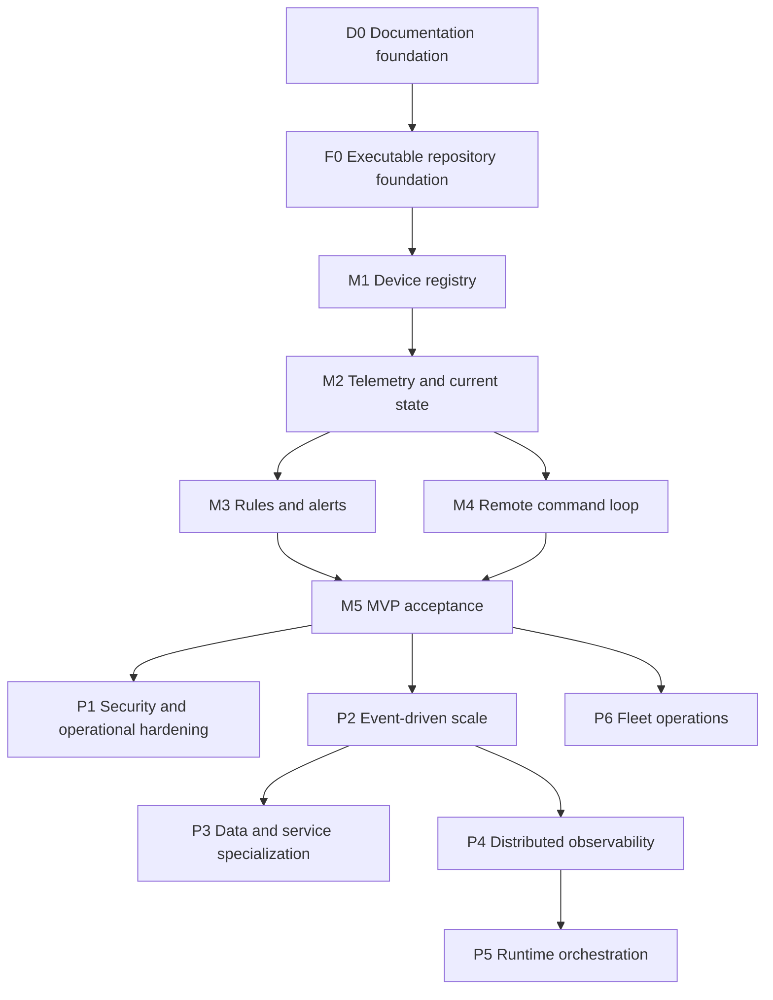
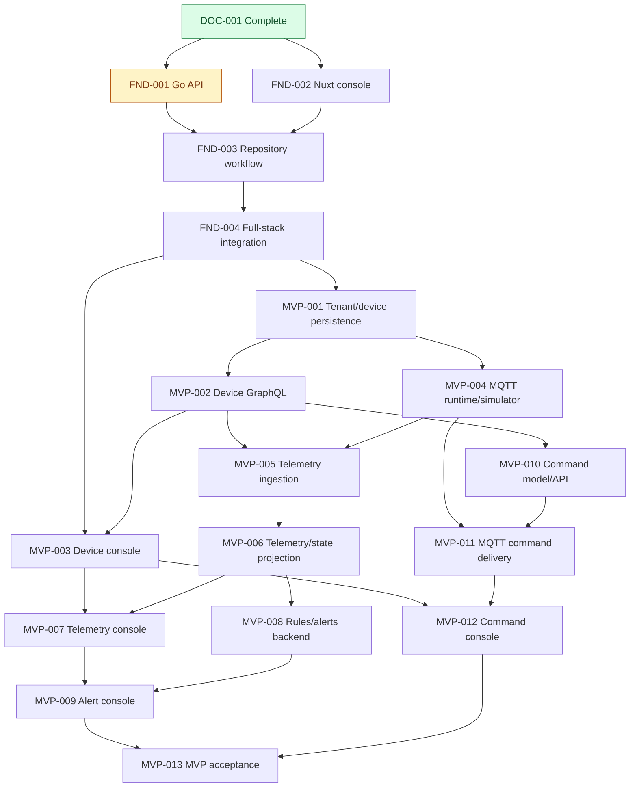

# PulseGrid Roadmap

Status: Planning source of truth

## Purpose

This roadmap owns milestone order, milestone outcome, dependency, and milestone
status. PR-level scope and status are owned by the linked feature plans.

The roadmap deliberately introduces infrastructure only when a product or
runtime requirement exists. Target technologies remain visible without being
treated as Foundation or MVP requirements by default.

## Status definitions

- **Proposed**: under review and not yet approved for execution.
- **Planned**: approved direction but implementation has not started.
- **In progress**: at least one required plan is actively being delivered.
- **Complete**: milestone outcome and required validation are complete.
- **Blocked**: progress requires a named decision or external change.
- **Deferred**: outside the current delivery horizon or waiting for an adoption
  trigger.

## Dependency flow

## Feature-plan dependency flow

The plan graph shows the minimum merge prerequisites. Plans on separate branches
may be reviewed in parallel only when the arrows do not connect them; milestone
outcomes still require every plan listed under that milestone.

FND-001 implementation is ready for review and establishes the backend runtime
shell. FND-002 is the next independently startable Foundation plan; FND-003
waits for both application foundations. FND-004 is the Foundation acceptance
gate before the first MVP persistence slice begins.

## Milestones

### D0 — Documentation foundation

Status: Complete

Dependency: None

Outcome: The repository has a concise GitHub entry point, explicit document
ownership, an MVP boundary, a dependency-ordered roadmap, and reviewable
feature plans.

Plans:

- [DOC-001 — Documentation foundation](feature-plans/completed/DOC-001-documentation-foundation.md)

### F0 — Executable repository foundation

Status: In progress

Dependency: D0

Outcome: The initial Go and Nuxt applications run locally, expose only the
documented operational API surface, have explicit development/test
configuration, and are protected by formatting, linting, tests, Git hooks, CI,
and documented developer commands.

Plans:

- [FND-001 — Go API foundation](feature-plans/planned/FND-001-go-api-foundation.md)
- [FND-002 — Nuxt console foundation](feature-plans/planned/FND-002-nuxt-console-foundation.md)
- [FND-003 — Repository quality and local workflow](feature-plans/planned/FND-003-repository-quality-and-local-workflow.md)
- [FND-004 — Full-stack development integration](feature-plans/planned/FND-004-full-stack-development-integration.md)

### M1 — Device registry

Status: Planned

Dependency: F0

Outcome: A controlled development operator can provision, list, and inspect
tenant-scoped devices through GraphQL and the console.

Plans:

- [MVP-001 — Tenant and device persistence](feature-plans/planned/MVP-001-tenant-device-persistence.md)
- [MVP-002 — Device GraphQL API](feature-plans/planned/MVP-002-device-graphql-api.md)
- [MVP-003 — Device registry console](feature-plans/planned/MVP-003-device-registry-console.md)

### M2 — Telemetry and current state

Status: Planned

Dependency: M1

Outcome: A registered simulated device publishes MQTT telemetry that becomes
validated recent telemetry and current state visible in the console.

Plans:

- [MVP-004 — MQTT local runtime and simulator](feature-plans/planned/MVP-004-mqtt-local-runtime-and-simulator.md)
- [MVP-005 — MQTT telemetry ingestion](feature-plans/planned/MVP-005-mqtt-telemetry-ingestion.md)
- [MVP-006 — Telemetry and current-state projection](feature-plans/planned/MVP-006-telemetry-current-state-projection.md)
- [MVP-007 — Telemetry and device-state console](feature-plans/planned/MVP-007-telemetry-device-state-console.md)

### M3 — Rules and alerts

Status: Planned

Dependency: M2

Outcome: A deliberately limited threshold rule evaluates accepted telemetry,
creates an alert, and exposes the triggering context to the operator.

Plans:

- [MVP-008 — Threshold rule and alert backend](feature-plans/planned/MVP-008-threshold-rule-alert-backend.md)
- [MVP-009 — Alert console](feature-plans/planned/MVP-009-alert-console.md)

### M4 — Remote command loop

Status: Planned

Dependency: M1 and M2

Outcome: An operator sends a command to a registered simulated device and sees
acknowledgement, completion, explicit failure, or timeout.

Plans:

- [MVP-010 — Command model and GraphQL API](feature-plans/planned/MVP-010-command-model-graphql-api.md)
- [MVP-011 — MQTT command delivery and acknowledgement](feature-plans/planned/MVP-011-mqtt-command-delivery-acknowledgement.md)
- [MVP-012 — Command console](feature-plans/planned/MVP-012-command-console.md)

### M5 — MVP acceptance

Status: Planned

Dependency: M3 and M4

Outcome: The complete device-to-operator-to-device product loop is repeatable,
observable, and validated from a clean local checkout.

Plans:

- [MVP-013 — End-to-end product loop](feature-plans/planned/MVP-013-end-to-end-product-loop.md)

## Post-MVP milestones

| Milestone | Dependency or adoption trigger | Outcome | Status |
| --- | --- | --- | --- |
| P1 — Security and operational hardening | M5 | Production identity, RBAC, audit, credential lifecycle, recovery controls | Deferred |
| P2 — Event-driven scale | M5 plus demonstrated fan-out, replay, or workload need | Kafka introduced for one concrete event flow with delivery and recovery semantics | Deferred |
| P3 — Data and service specialization | Measured data, scaling, reliability, or ownership pressure | Evidence-backed MongoDB/time-series/Redis adoption or service extraction | Deferred |
| P4 — Distributed observability | Cross-process boundaries exist | OpenTelemetry context, operational metrics, Prometheus/Grafana, and defined diagnostic journeys | Deferred |
| P5 — Runtime orchestration | Deployment, availability, or scaling need exists | Kubernetes/Helm; KEDA only for established Kafka-lag scaling | Deferred |
| P6 — Fleet operations | Stable device and command models | Device groups, progressive configuration/firmware rollout, failure visibility, rollback | Deferred |

Post-MVP milestone order may change when evidence changes. An adoption trigger
authorizes planning and review, not automatic implementation.

Planned packaging work:

- [OPS-001 — Application container images](feature-plans/planned/OPS-001-application-container-images.md) is deferred until a containerized run or deployment target exists.

## Scope boundaries

The authoritative Foundation, MVP, Post-MVP, and non-goal definitions are in
the [product scope](../product/product-scope.md). Technology selection and
deferral status are in [technology decisions](../architecture/technology-decisions.md).

## Updating this roadmap

- Update milestone status only when its outcome changes state.
- Add a feature-plan link before starting implementation.
- Keep one intended PR per plan unless review proves a different boundary is
  smaller and independently valuable.
- Re-plan dependencies when a plan introduces a new data, security, runtime,
  or external-system boundary.
- Do not move a target technology into an earlier milestone without naming the
  requirement and validation it enables.
